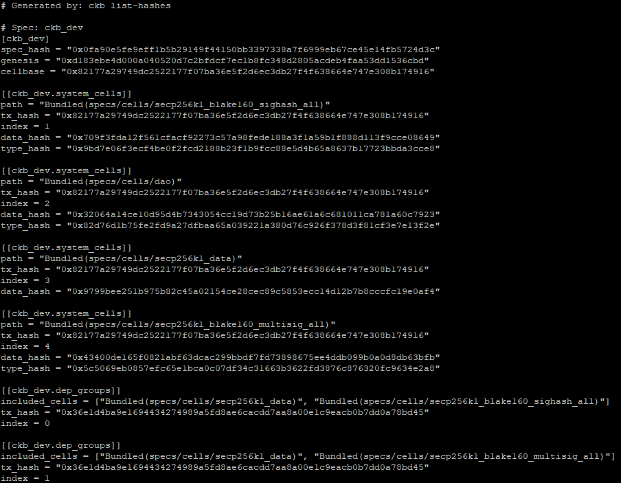

# Lab Exercise Setup

### Setup Introduction

In order to follow along with the examples and complete the lab exercises, some basic software and tooling will need to be installed on your computer.

Our examples are all created using a Linux environment, and this is the preferred environment for development on Nervos in general. It should also work for MacOS and Windows, but there may be a few extra steps you will need to take to get things working.

### Install Node.js (v18 LTS)

Our lessons and lab exercises all rely on Node.js v18 LTS, so this will need to be installed prior to starting. We officially support and test only with this exact version. If you experience any problems, please make sure you are using the correct version of Node.js.

Installing vanilla Node.js is fine or you can use a tool like NVM to manage the installation. Many developers prefer using NVM since it allows you to quickly select between different versions of Node.js without having to reinstall.

* Vanilla Node.js (All Platforms): [https://nodejs.org/en/download/](https://nodejs.org/en/download/)
* NVM (Linux & MacOS): [https://github.com/nvm-sh/nvm](https://github.com/nvm-sh/nvm)
* NVM (Windows): [https://github.com/coreybutler/nvm-windows](https://github.com/coreybutler/nvm-windows)&#x20;

### Install Rust

We will be using the Rust programming language to create on-chain scripts and install the required tooling. Using `rustup` is generally recommended, but there are several methods available.

* Rust (All Platforms): [https://www.rust-lang.org/tools/install](https://www.rust-lang.org/tools/install)

### Install Git

You will need Git to clone the example code and lab exercises from GitHub in order to complete each lesson. Using your favorite Git client is fine.

* Git (All Platforms): [https://git-scm.com/downloads](https://git-scm.com/downloads)

### Clone the Developer Training Course Materials

Use the command below to clone the Developer Training Course materials, which includes the example code and lab exercises we will use in the lessons.

```
git clone https://github.com/jordanmack/developer-training-course.git
```

Then enter the directory and install the Node.js dependencies.

```bash
cd developer-training-course
npm i
```

While installing dependencies using `npm i` you may get some warnings. This is normal and does not always indicate a problem. If you encounter errors, make sure you are on the correct version of Node.js by using the command `node -v`.

### Setup a CKB Dev Blockchain

You will need to have a CKB Dev Blockchain node running locally for our code to interact with. This is a full Nervos CKB node that will run on your computer with a private testnet, also known as a devnet.

You will need to complete the setup instruction from the URL below for the sections "Setup a Dummy-Worker Blockchain" and "Adding the Genesis Issued Cells".

* CKB Dev Blockchain Setup Instructions: [https://docs.nervos.org/docs/basics/guides/devchain](https://docs.nervos.org/docs/basics/guides/devchain)

Alternatively, if you are using an OS with a GUI you can use Tippy to create a one-click devnet.

* Tippy One-Click Devnet CKB Node Tool: [https://github.com/nervosnetwork/tippy](https://github.com/nervosnetwork/tippy)

### Update Your Chain Hashes in config.json

After you have created your devnet, you will need to copy some of the chain configuration values into the developer-training-course repo. The scripts we will be using require this information about the devnet in order to locate resources to create transactions properly.

From the console, enter the directory where you have your devnet CKB Node, and run the following command.

```
./ckb list-hashes
```

This should give you console output similar to the following.



The system cell hashes are specifically the ones we are interested in. These describe the locations of resources the Developer Training Course will need. You will need to copy these values into the file `developer-training-course/config.json` in the correct locations. This `config.json` file will be used by the Lumos framework in the later lessons to create transactions.

The table below describes the values that need to be updated in `config.json`, and where they come from the output from `./ckb list-hashes`. The format of `config.json` and the output of `./ckb list-hashes` are structured differently, so you will need to match them up manually.

For example, the `SECP256K1_BLAKE160` key in `config.json` corresponds with the config group that contains the line `included_cells = ["Bundled(specs/cells/secp256k1_data)", "Bundled(specs/cells/secp256k1_blake160_sighash_all)"]`. The values for `SECP256K1_BLAKE160.TX_HASH` and `SECP256K1_BLAKE160.INDEX` are contained in the lines directly underneath.

| config.json                            | ckb list-hashes                                         |
| -------------------------------------- | ------------------------------------------------------- |
| SECP256K1\_BLAKE160                    | Bundled(specs/cells/secp256k1\_blake160\_sighash\_all)  |
| SECP256K1\_BLAKE160.TX\_HASH           | tx\_hash                                                |
| SECP256K1\_BLAKE160.INDEX              | index                                                   |
| SECP256K1\_BLAKE160\_MULTISIG          | Bundled(specs/cells/secp256k1\_blake160\_multisig\_all) |
| SECP256K1\_BLAKE160\_MULTISIG.TX\_HASH | tx\_hash                                                |
| SECP256K1\_BLAKE160\_MULTISIG.INDEX    | index                                                   |
| DAO                                    | Bundled(specs/cells/dao)                                |
| DAO.TX\_HASH                           | tx\_hash                                                |
| DAO.INDEX                              | index                                                   |

A total of six values should be updated in total. This process only needs to be done once, but if you set up a new dev chain, you will need to repeat this process since the values will be different.
