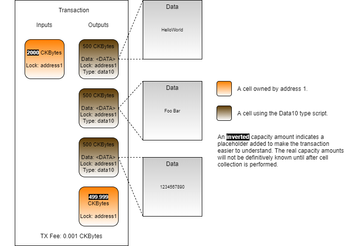

# Conditional Unlocking

When the lock script executes it has access to any values that are provided in the transaction. This includes the inputs, outputs, and cell deps. The lock script can use any of these resources as part of its criteria to determine if the cell should unlock or not.

Let's look at another example lock script in pseudo-code. This one will examine the transaction, and only unlock if the total capacity in all of the inputs is exactly 500 CKBytes.

```javascript
function main()
{
    total_capacity = 0;
    
    input_cells = load_input_cells();
    for(cell in input_cells)
    {
        total_capacity += cell.capacity;
    }

    if(total_capacity == 500 * 100000000) // 500 CKBytes in Shannons
    {
        return 0;
    }
    else
    {
        return 1;
    }
}
```

This code should be reasonably easy to understand. The input cells are loaded from the transaction, and then the capacity of each input cell is tallied. If the total input capacity is exactly 500 CKBytes, then the lock script will return with 0, indicating success.

This lock script is conceptually different than the default lock script because it shows how a script can expand its scope of concern. The code is examining all the input cells unconditionally. It doesn't matter if the input cells have a matching lock script, or are even owned by different people. All the code cares about is the input capacity amount.

This code is a good example to demonstrate how funds can be unlocked with smart contract-like conditions instead of signatures, but it should never be used outside of a test environment. The code does not use signatures to prove ownership in any way, which means that anyone could unlock the cell and take the capacity contained within if they knew how the lock works.

### Usage in Lumos

Open the `index.js` file from the `Conditional-Unlocking-Example` directory and scroll down to the `main()` function. Just like the code from the previous topic, this code has four main sections.


This should look familiar because it is the same basic process. All that is changing is the lock script in use and a few details in the transaction structure which we'll explain.

### Deploying the CKB 500 Binary

The process begins with deploying the lock script binary that contains our conditional code which only unlocks when the input capacity is exactly 500 CKBytes. We will call this the "CKB 500" lock going forward. This code is contained in `deployCkb500Binary()`. Feel free to go over it, but we're not going to go through it here since it is nearly identical to the previous examples.

### Creating the CKB 500 Cells

Next, we will look at the relevant parts of the `createCellsWithCkb500Lock()` function.

```javascript
	// Create cells using the CKB 500 lock.
	const outputCapacity1 = ckbytesToShannons(250n);
	const lockScript1 =
	{
		code_hash: dataFileHash1,
		hash_type: "data",
		args: "0x"
	}
	const output1 = {cell_output: {capacity: intToHex(outputCapacity1), lock: lockScript1, type: null}, data: "0x"};
	transaction = transaction.update("outputs", (i)=>i.concat([output1, output1]));
```

This is the code that creates the cells using the CKB 500 lock. On line 2 you will see that we are creating cells with a capacity of exactly 250 CKBytes. We chose that number because it will be easy to create a transaction with exactly 500 CKBytes of input capacity.

On lines 5-7 we specify the data hash of the CKB 500 lock for the `code_hash` and once again `args` is empty because it isn't used. The CKB 500 lock only cares about input capacity, so it doesn't read the `args` value at all.

If you were to put a random value into the `args` it would do nothing. However, if you added a value to the args you would have a higher capacity requirement. It would also make the cell harder to locate later, and we will show you why in the next section.

If you look closely at line 10, you will notice that we are adding `output1` to the transaction two times, therefore creating two cells with 250 CKBytes each.

Our resulting transaction should look similar to this.



### Consuming the CKB 500 Cells

Next, we will look at the relevant parts of the `consumeCellsWithCkb500Lock()` function.

```javascript
	// Add the cell dep for the lock script.
	const cellDep = {dep_type: "code", out_point: ckb500CodeOutPoint};
	transaction = transaction.update("cellDeps", (cellDeps)=>cellDeps.push(cellDep));
```

Just like the previous example, we have to add our CKB 500 code as a cell dep to the transaction. It is only added to the consume function because this is the only place where the CKB 500 lock script is executing.

```javascript
	// Add the CKB 500 cells to the transaction. 
	const capacityRequired = ckbytesToShannons(500n);
	const lockScript1 =
	{
		code_hash: dataFileHash1,
		hash_type: "data",
		args: "0x"
	};
	const collectedCells = await collectCapacity(indexer, lockScript1, capacityRequired);
	transaction = transaction.update("inputs", (i)=>i.concat(collectedCells.inputCells));
```

Next, we add the CKB 500 cells to the transaction. However, unlike the previous example, we are not directly adding the outpoint. Instead, we are using the `collectCapacity()` library function to locate the cells. We pass the lock script to the function, which will collect only cells created with the CKB 500 lock.

Normally when cell collection is performed you cannot be assured of the exact capacity value of the cells that are returned. In this example, we specifically created two cells each with 250 CKBytes each. We knew ahead of time that these would be the only two cells that exist with the CKB 500 lock so we can skip some of the extra code to verify. 

The lock script we specify to query for these cells is exactly the same as the one used to create the cells. Earlier, we said that `args` isn't used, but that adding a random value may make it harder to locate. This is because you must specify the `code_hash`, `hash_type`, and `args` explicitly in a query. All three values are required, and they cannot be wildcards.

```javascript
	// Add in the witness placeholders.
	// transaction = addDefaultWitnessPlaceholders(transaction);

	// Sign the transaction.
	// const signedTx = signTransaction(transaction, privateKey1);
	const signedTx = sealTransaction(transaction, []);
```

On lines 2 and 5 we have commented out the normal code we have been using. Lines 2 adds in the required placeholders for signing using the default lock script, and line 5 signs the transaction using the Secp256k1 algorithm which is required by the default lock script.

We don't need to go through the normal signing process because we are only using the CKB 500 cells as inputs. The CKB 500 lock does not check signatures at all, so adding a signature would have no effect on this transaction.

On line 6 we use `sealTransaction()`, which replaces the placeholders with the required signatures. The array passed to the function is empty because we didn't create any signatures. We will be coving all of this in much greater detail later on. What is important to understand now is that different locks scripts have different requirements for signing and the CKB 500 lock is an example of how a lock can require no signatures at all. 

Our resulting transaction will look like this.


