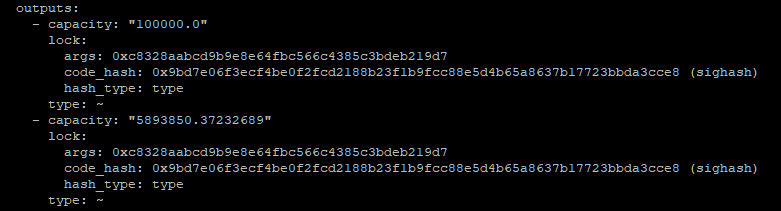

# Using a Custom Lock Script

Lock Scripts are one of the many powerful features that differentiate Nervos from most other blockchain platforms. A Lock Script is a small program \(called a script\), that is used to define ownership of a Cell. This program has the ability to fully examine the transaction it is included within. This gives the developer a tremendous amount of flexibility on how to manage access.

The default Lock Script is based on Secp256k1 cryptography, making it nearly identical to Bitcoin and Ethereum. This allows a Cell to be owned and unlocked by any user who possesses the private key. However, a Lock Script can do much more. A Cell can be owned by a single person, by multiple people using a multi-sig lock script, by another script similar to a smart contract, or by no one.

### The Structure of a Lock Script

When we talk about a Lock Script, it's important to pay attention to the context. Lock Script can refer to the data structure that is defined within a Cell, or the underlying code which defines how the script operates. Right now, we're discussing the data structure.

Here is an image of the outputs from a `rpc get_transaction` request in `ckb-cli`.



In the above image, the `lock` defines the Lock Script and it has three structural elements:

* `args` are short for arguments. This data provided to the Lock Script similarly to how arguments can be passed to a normal command-line program.
* `code_hash` is a Blake2b hash of the code that defines the Lock Script. The code itself is a RISC-V binary executable that is stored on-chain. 
* `hash_type` controls how the `code_hash` is used in a transaction. It is used in the process of upgrading smart contracts. We will cover more about the usage of `hash_type` at a later time.

The `code_hash` value of `0x9bd7e06f3ecf4be0f2fcd2188b23f1b9fcc88e5d4b65a8637b17723bbda3cce8` is the default Lock Script which uses Secp256k1 cryptography. When a Cell is included in a transaction, the binary code matching the `code_hash` will execute and verify that the proper Secp256k1 signature was provided.

### Lock Args

The Lock Script `args` can include any data needed to prove ownership. In the case of the Secp256k1 Lock Script, the `args` represent the associated Secp256k1 public key that owns the Cell. Specifically, it is formatted as a 256-bit \(32 byte\) Blake2b hash of the user's public key, truncated to 160 bits \(20 bytes\). This is commonly referred to as the `lock_arg` and it is used often as a means of identifying an account.

The output from `account list` in `ckb-cli` shows the `lock_arg`.


Pay close attention to the `lock_arg` value of the first account. The `lock_arg` has a value of `0xc8328aabcd9b9e8e64fbc566c4385c3bdeb219d7` which is an exact match for the `lock_arg` values in the previous screenshot of transaction outputs. The `lock_arg` is the account that owns the Cell, and since it matches, we know that those Cells are owned by the first account listed in the above screenshot.

### Lock Hash

A `lock_hash` is another common value that is used for identifying ownership of a Cell. A `lock_hash` is a Blake2b hash of the Lock Script data structure. A Lock Script contains `args`, `code_hash`, and `hash_type`. A Lock Script is less convenient to reference since all three of these values must be known. Since a `lock_hash` encompasses all three of these values, it serves the purpose of a single value identifier of Cell ownership.

### Cell Deps

We already learned about Input Cells and Output Cells, but there is a third type called Cell Deps. Short for Cell Dependencies, Cell Deps are similar to Input Cells, but they are not consumed. They can be used repeatedly by many scripts as a read-only component of the transaction.

Some of the common uses of Cells Deps are:

* Script Code - A Lock Script references the `code_hash` of the code it needs to execute, but it still needs to know where the code resides. This is done by specifying a Live Cell that contains this code as a Cell Dep.
* Script Libraries - Just like a library for a normal application, a script library contains commonly used code in scripts.
* State Data - A Cell can contain any data, including state data for a smart contract. Data from an oracle is a good example. The data published by the oracle is read-only and can be utilized by many smart contracts that rely on it.

### Default Lock Script Cell Deps

The default Lock Script has a `code_hash` of `0x9bd7e06f3ecf4be0f2fcd2188b23f1b9fcc88e5d4b65a8637b17723bbda3cce8`. This tells CKB-VM the script that it needs to match to execute, but it doesn't tell it where that Cell is. To do that, we must add a Cell Dep for a Live Cell that has the matching script code that we need.

```javascript
// Add the cell dep for the lock script.
skeleton = skeleton.update("cellDeps", (cellDeps)=>cellDeps.push(locateCellDep({code_hash: "0x9bd7e06f3ecf4be0f2fcd2188b23f1b9fcc88e5d4b65a8637b17723bbda3cce8", hash_type: "type"})));
```

The code above is how we can quickly add a Cell Dep for the default Lock Script. You don't need to dig into this now. Just know that it is using Lumos to locate an out point for a Live Cell that contains the script code needed to execute the default Lock Script.

### Advantages of Lock Scripts

There are several advantages to using Lock Scripts instead of the hardcoded authentication methods which are used in most other blockchains.

#### Flexibility

The developer is able to have complete control over how authentication is handled. When new cryptography standards emerge in the future, using them is as simple as including a new library in your codebase.

However, the flexibility of Lock Scripts goes far beyond new cryptography. We will cover more cases in future lessons that demonstrate how a Lock Script plays a critical role in more complicated dapps.

#### Scalability

The Cell Model allows for very high-performance script execution. This is possible because each Live Cell is a piece of immutable state that is effectively pre-sharded. Lock Scripts can be executed in parallel, leading to massive scalability on layer 1, and even higher on layer 2.

#### Recoverability

Cell Deps also provide a means of recovering a smart contract if a necessary dependency is consumed, removing it from the state. Cell Deps are never linked to a specific out point, so any resource can be securely redeployed as long as the original source code or binary is available.

