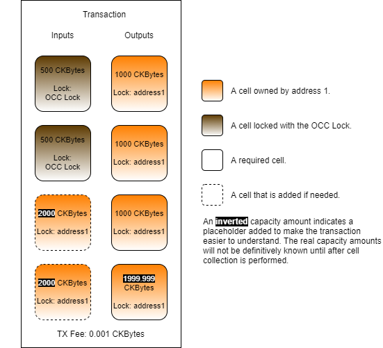

# Using Multiple Lock Args

Each lock script has a single `args` field. In the last example, we populated that field with a single value, but it is very common for scripts to require multiple values. The lock that is used sets the requirements for the data necessary and how it is formatted. This also includes how multiple values are encoded into the `args` field.

In our last lock script pseudo-code example, we started with the following line.

```javascript
function lockScript(args, input_cells)
```

We did this to make it easier to understand conceptually how pieces of data are passed to the lock when it executes. Lock execution is similar to a pure function and always has a deterministic result. However, this is a simplification of how it is done. In actuality, every lock is a program and all the information that the program requires is obtained using loader functions in the form of system calls. We will be using this syntax in our pseudo-code going forward, and we will cover more about the available system calls in a later lesson.

Let's take a look at a lock that requires multiple `args` values in pseudo-code.

```javascript
function main()
{
    lock_args = load_lock_args().deserializeArray();
    capacity_required = integer_from_binary(lock_args[0]);
    count_required = integer_from_binary(lock_args[1]);

    matches_found = 0;
    output_cells = load_output_cells();
    for(cell in output_cells)
    {
        if(cell.capacity == capacity_required)
        {
            matches_found = matches_found + 1;
            
            if(matches_found >= count_required)
            {
                return 0;
            }
        }
    }
    
    return 1;
}
```

This lock has some similarities to the previous "ICC Lock", but there are a few changes. This code takes both an amount of `capacity_required` and a `count_required` as arguments, and will only unlock if there are at least `count_required` **output cells** that have a capacity of exactly `capacity_required`. We will call this the "Output Capacity Check Lock" going forward, or "OCC Lock" for short.

On lines 3 to 5, we load the `args` data, deserialize it to an array, then extract the two values we need to work with.

On lines 7 to 22, the code loads every output cell and checks the capacity. If it finds an input cell with a capacity matching `capacity_required`, then it increases the `matches_found` value. If match count is equal or greater to the `count_required` value then it unlocks. If the match count is below the `count_required` threshold, then an error will be returned.

Let's look at lines 3 to 5 again. We deserialized an array on line 3, which was very easy to work with. This works well, but the serialization can add overhead to both the computational cycles required and the state storage required. For that reason, it is more common to encode values directly in binary and then pack them next to each other without any serialization library. That would look like this.

```javascript
lock_args = load_lock_args();
capacity_required = integer_from_binary(lock_args[0..8]);
count_required = integer_from_binary(lock_args[8..16]);
```

Instead of using an array, we just read byte offsets directly. Our lock is using 64-bit integer values, so we know the length of the data we need is always 8 bytes for each value. These values will not vary in size, so they can safely be packed next to each other in the `args` field.

This code is an example of how to use `args` to create smart contract-like conditions to unlock a cell, but this exact lock should never be used outside of a test environment. The code does not use signatures to prove ownership in any way, which means that anyone could unlock the cell and take the capacity contained within if they knew how the lock works.

### Usage in Lumos

Next, we will use the OCC Lock in a Lumos transaction example. Our code will deploy the lock, create some cells using the OCC Lock, then consume those cells that we just created to reclaim that capacity.

Open the `index.js` file from the `Using-Multiple-Lock-Args-Example` directory and scroll down to the `main()` function. Our code has the usual four sections.


The initialization and deployment code is nearly identical to the previous examples, so we're not going to go over it here. Feel free to review that code on your own if you need a refresher.

### Creating the OCC Lock Cells

Next, we will look at the relevant parts of the `createCellsWithOccLock()` function. This function generates and executes a transaction that will create cells using the OCC Lock.

```javascript
// Create cells using the OCC Lock.
const outputCapacity1 = ckbytesToShannons(500n);
const occLockAmount1 = intToU64LeHexBytes(ckbytesToShannons(1_000n));
const occLockCount1 = intToU64LeHexBytes(3);
const lockScript1 =
{
	code_hash: dataFileHash1,
	hash_type: "data",
	args: occLockAmount1 + occLockCount1.substr(2)
};
const output1 = {cell_output: {capacity: intToHex(outputCapacity1), lock: lockScript1, type: null}, data: "0x"};
transaction = transaction.update("outputs", (i)=>i.concat([output1, output1]));
```

This is the code that creates the cells that use the OCC Lock.

On line 2, you will see that we are creating cells with a capacity of exactly 500 CKBytes.

On line 3, we specify the capacity that must be present on any output to unlock the cell. We are specifying 500 CKBytes as a 64-bit little-endian value as hex bytes. This specific binary format is used because it is what is expected by OCC Lock.

On line 4, we specify the minimum number of output cells that must match the capacity on line 3. The value is three, which means the outputs must have three cells with exactly 1,000 CKBytes in order for this input cell to unlock. 

On line 7, we specify the data hash of the OCC Lock for the `code_hash`.

On line 8, we add our amount and count values as `args`. They are packed together side by side as a single value as a hex string. The reason the second value uses `.substr(2)` is to remove the `0x` prefix when the hex string is concatenated.

If you look closely at line 12, you will notice that we are adding `output1` to the transaction two times, therefore creating two cells with 500 CKBytes each.

Our resulting transaction should look similar to this.


### Consuming the OCC Lock Cells

Next, we will look at the relevant parts of the `consumeCellsWithOccLock()` function. This function generates and executes a transaction that will consume the cells we just created that use the OCC Lock.

```javascript
// Add the OCC Lock cells to the transaction. 
const capacityRequired1 = ckbytesToShannons(1_000n);
const occLockAmount1 = intToU64LeHexBytes(ckbytesToShannons(1_000n));
const occLockCount1 = intToU64LeHexBytes(3);
const lockScript1 =
{
	code_hash: dataFileHash1,
	hash_type: "data",
	args: occLockAmount1 + occLockCount1.substr(2)
};
const collectedCells = await collectCapacity(indexer, lockScript1, capacityRequired1);
transaction = transaction.update("inputs", (i)=>i.concat(collectedCells.inputCells));
```

Here we add the OCC Lock cells to the transaction. We are using the `collectCapacity()` library function to locate the cells. The lock script we specify is exactly the same as when we created the cells in the previous function, which ensures we get the exact same kind of cells, and specifying the `capacityRequired` as 1,000 CKBytes should pull in the two cells we just created which were each 500 CKBytes. 

```javascript
// Add an output cell with the specific amount required by the OCC Lock.
const outputCell = {cell_output: {capacity: intToHex(ckbytesToShannons(1_000n)), lock: addressToScript(address1), type: null}, data: "0x"};
transaction = transaction.update("outputs", (i)=>i.concat([outputCell, outputCell, outputCell]));
```

Here we add three output cells to the transaction, each with a capacity of 1,000 CKBytes. These cells are being added to the transaction to fulfill the requirements of the OCC Lock to unlock.

Our resulting transaction thus far looks like the image below. Do you see the problem? 


The input capacity is 1,000 CKBytes, but the output capacity is 3,000 CKBytes. This transaction is invalid and would not confirm. To fix this we need to add more capacity.

```javascript
// Determine the capacity from input and output cells.
let inputCapacity = transaction.inputs.toArray().reduce((a, c)=>a+hexToInt(c.cell_output.capacity), 0n);
let outputCapacity = transaction.outputs.toArray().reduce((a, c)=>a+hexToInt(c.cell_output.capacity), 0n);

// Add capacity to the transaction.
const capacityRequired2 = outputCapacity - inputCapacity + ckbytesToShannons(61n) + txFee;
const {inputCells} = await collectCapacity(indexer, addressToScript(address1), capacityRequired2);
transaction = transaction.update("inputs", (i)=>i.concat(inputCells));
```

This code calculates the current input and output capacities, then performs cell collection to locate more cells for this. This code is nearly identical to some of the previous examples, so it should look familiar.

```javascript
// Recalculate new input capacity.
inputCapacity = transaction.inputs.toArray().reduce((a, c)=>a+hexToInt(c.cell_output.capacity), 0n);

// Create a change Cell for the remaining CKBytes.
const changeCapacity = intToHex(inputCapacity - outputCapacity - txFee);
const change = {cell_output: {capacity: changeCapacity, lock: addressToScript(address1), type: null}, data: "0x"};
transaction = transaction.update("outputs", (i)=>i.push(change));
```

This code recalculates the input capacity with the new input cells we just added, then it adds a change cell. Our resulting transaction will look like this.



This transaction would complete because `address1` provided additional cells with the required capacity to complete the transaction.

```javascript
// Add in the witness placeholders.
transaction = addDefaultWitnessPlaceholders(transaction);

// Sign the transaction.
const signedTx = signTransaction(transaction, privateKey1);
```

Lastly, we add the necessary witness placeholders and sign the transaction. In the last topic, we didn't need to add signatures because the ICC Lock does not check them. The OCC Lock also does not check signatures. Do you know why we need to add signatures to this transaction?

The reason is that we added more input cells owned by `address1` because we need additional capacity to complete the transaction. These cells use the default lock script, and therefore always require a signature.

