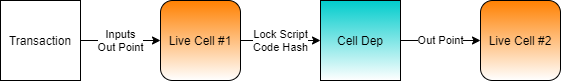

# Using a Custom Lock Script

Lock Scripts are one of the many powerful features that differentiate Nervos from most other blockchain platforms. A Lock Script is a small on-chain program \(called a script\), that is used to define ownership of a cell. This program has the ability to fully examine the transaction it is included within. This gives the developer a tremendous amount of flexibility on how to manage access to cells.

The default Lock Script is based on Secp256k1 cryptography, making it nearly identical to Bitcoin and Ethereum. This allows a cell to be owned and unlocked by any user who possesses the private key. However, a Lock Script can do much more. A cell can be owned by a single person, by multiple people using a multi-sig lock script, by another script similar to a smart contract, or by no one.

When testing dapps and smart contracts, it is often convenient to test transactions using special Lock Scripts which always succeed \(unlock\) or always fail \(never unlock\) in any transaction. We will demonstrate how to create cells with these special locks, but first, we need to understand the structure of a Lock Script to do so.

### The Structure of a Lock Script

When we talk about a Lock Script, it's important to pay attention to the context. Lock Script can refer to the data structure that is defined within a cell, or the underlying code which defines how the script operates. Right now, we're discussing the data structure.

Here is an image of the output from a `rpc get_live_cell` request in `ckb-cli`.


In the above image, the `lock` defines the Lock Script and it has three structural elements:

* `args` are short for arguments. This is data provided to the Lock Script similarly to how arguments can be passed to a normal command-line program.
* `code_hash` is a Blake2b hash of the code that defines the Lock Script. The code itself is a RISC-V binary executable that is stored on-chain in another cell. 
* `hash_type` controls how the `code_hash` is used in a transaction. It is used in the process of upgrading smart contracts. We will cover more about the usage of `hash_type` in the next lesson.

The `code_hash` value of `0x9bd7e06f3ecf4be0f2fcd2188b23f1b9fcc88e5d4b65a8637b17723bbda3cce8` is the default Lock Script which uses Secp256k1 cryptography. When a cell is included in a transaction, the binary code matching the `code_hash` will execute and verify that the proper Secp256k1 signature was provided.

To explain it another way, the `code_hash` value is a way of indicating what code should execute to determine if the cell should grant access and unlock. The `code_hash` value itself does not contain any logic to make this determination. It simply indicates what code should make that determination.

When the default Secp256k1 lock script \(`0x9bd7...cce8`\) executes, it makes that determination by checking if the proper credentials were provided using the Secp256k1 algorithm. To do this, it matches values from the Lock Args with values from the Witnesses. The Lock Args contains a hash of the owner's public key, and the Witnesses contains a value signed with the owner's private key. We will show exactly how this works later, but we will not need these for the always success and always fail lock scripts since they do not rely on those.

So far we know that a transaction has input cells, and each one of these inputs is referenced by an out point to a live cell. Each one of these cells has a lock script that indicates what code should execute using the code hash, but there is still something missing.


The code hash is describing the code that should execute, but it does not indicate where the code is located on the blockchain. To do this, we need to use a cell dep.

### Cell Deps

We already learned about input cells and output cells, but there is a third type called cell deps. Short for cell dependencies, cell deps are similar to input cells, but they are not consumed. They can be used repeatedly by many scripts as a read-only component of the transaction.

Some of the common uses of cells deps are:

* Script Code - A lock script references the `code_hash` of the code it needs to execute, but it still needs to know where the code resides. This is done by specifying a live cell that contains this code as a cell dep.
* Script Libraries - Just like a library for a normal application, a script library contains commonly used code in scripts.
* State Data - A cell can contain any data, including state data for a smart contract. Data from an oracle is a good example. The data published by the oracle is read-only and can be utilized by many smart contracts that rely on it.

With the addition of cell deps we now have a complete path from the transaction to the code.



Live Cell \#1 has a lock script with a `code_hash` that matches the data in Live Cell \#2. The data in Live Cell \#2 is a RISC-V binary that contains the logic needed to determine if a cell should unlock in a transaction.

### Using the Always Success Lock in Lumos

Open the `index.js` file from the `Using-a-Custom-Lock-Script-Example` folder. If you scroll down to the `main()` function, you will see that there four main sections.


1. Initialize - There are the first three lines of code in `main()`. We initialize the Lumos configuration, start the Lumos Indexer, and initialize the lab environment.
2. Deploy Code - The `deployAlwaysSuccessBinary()` function creates a cell with the contents of the RISC-V binary located in the file `./files/always_success`. This is the always success lock, an on-chain script that always grants permission to the cell in any transaction.
3. Create Cell - The `createCellWithAlwaysSuccessLock()` function creates a cell that uses the always success lock.
4. Consume Cell - The `consumeCellWithAlwaysSuccessLock()` function consumes the cell with the always success lock that we just created.

### Deploying the Always Success Binary

Let's go through the `deployAlwaysSuccessBinary()` function. Some of the code at the beginning and end is redundant from previous topics, so we will only cover the relevant code.

```javascript
// Create a cell with data from the specified file.
const {hexString: hexString1, dataSize: dataSize1} = await readFileToHexString(dataFile1);
const outputCapacity1 = ckbytesToShannons(61n) + ckbytesToShannons(dataSize1);
const output1 = {cell_output: {capacity: intToHex(outputCapacity1), lock: addressToScript(address1), type: null}, data: hexString1};
transaction = transaction.update("outputs", (i)=>i.push(output1));
```

This code should look familiar since we've used it several times before. We're creating a cell that contains the contents of the always success binary.

Here is the transaction path from earlier:


The cell we just created would be Live Cell \#2 in this image. It is the code that will be referenced as a cell dep by it's outpoint.

At the end of the function you will see this code:

```javascript
// Return the out point for the always success binary so it can be used in the next transaction.
const outPoint =
{
	tx_hash: txid,
	index: "0x0"
};
return outPoint;
```

We're returning the out point of the cell we just created so that it can be used in the next transaction.

One important point of note is that this cell is intended for use as a cell dep, not as an input. If you remember from earlier, unlike an input, a cell dep is not consumed. This means that we can use this cell over and over again as a cell dep in multiple transactions. The binary only has to be deployed once, and then it can be used as many times as needed.

### Creating a Cell with the Always Success Lock

Next, let's look at the `createCellWithAlwaysSuccessLock()` function. Once again, we'll skip straight to the relevant parts.

```javascript
// Create a cell using the always success lock.
const outputCapacity1 = ckbytesToShannons(41n);
const lockScript1 =
{
	code_hash: dataFileHash1,
	hash_type: "data",
	args: "0x"
}
const output1 = {cell_output: {capacity: intToHex(outputCapacity1), lock: lockScript1, type: null}, data: "0x"};
transaction = transaction.update("outputs", (i)=>i.push(output1));
```

There are a few interesting things about this code. Look at the value of the `outputCapacity1` variable. It's set to 41 CKBytes. You may be thinking, "isn't the minimum 61?" Yes, 61 CKBytes is the minimum for a standard cell using the default lock script, but we're not using the default lock script.

The `lockScript1` variable defines the lock script for the cell. The `code_hash` is being set to a Blake2b hash of the always success lock script binary. The `hash_type` is `data`, which means the `code_hash` value needs to match a Blake2b hash of the data in a cell containing the code that will be executed. Our `code_hash` value reflects this. Finally, we have the `args` value. Notice that it's empty. Let's compare it to the `args` of a live cell using the default lock script: 


The `args` value is set to a 160-bit Blake2b hash of the owner's Secp256k1 public key. This identifies the owner of the cell, and their Secp256k1 private key is required to unlock it. Having this information allows the default lock script to match the public key against the signature provided in the witnesses of the transaction to verify that the owner gave their permission to use the cell in the transaction.

This 160-bit `args` value takes up exactly 20 bytes of space. The always success lock does no validation of any kind, and therefore we don't need to put anything in the args at all. This saves that 20 bytes of space, and is the reason out cell only needs 41 CKBytes instead of the normal 61 CKBytes.   

Even though this saves a little bit of space, it isn't practical to use in a production environment. The always success lock is completely insecure, which is why we only use it for testing purposes.

### Consuming a Cell with the Always Success Lock

Now let's look at the relevant parts of the `consumeCellWithAlwaysSuccessLock()` function.

```javascript
// Add the cell dep for the lock script.
transaction = addDefaultCellDeps(transaction);
const cellDep = {dep_type: "code", out_point: alwaysSuccessCodeOutPoint};
transaction = transaction.update("cellDeps", (cellDeps)=>cellDeps.push(cellDep));
```

This code adds cell deps to our transaction skeleton. On line 2 you see the function `addDefaultCellDeps()`. If we look into the shared library, we will see this:

```javascript
function addDefaultCellDeps(transaction)
{
	return transaction.update("cellDeps", (cellDeps)=>cellDeps.push(locateCellDep({code_hash: DEFAULT_LOCK_HASH, hash_type: "type"})));
}
```

We can see that this function is adding a cell dep for the default lock hash, and it's getting it from the `locateCellDep()` function. The `locateCellDep()` function is part of Lumos, and it can be used to locate specific well-known cell deps for the default Secp256k1 lock script, the multisig lock script, and the Nervos DAO. This function is getting this information from the `config.json` file in the working directory.

However, we will not be able to use the `locateCellDep` function with the always success binary we just loaded, because it is not well-known. Instead, we construct a cell dep object which we add to the cell deps in the transaction using this code:

```javascript
const cellDep = {dep_type: "code", out_point: alwaysSuccessCodeOutPoint};
transaction = transaction.update("cellDeps", (cellDeps)=>cellDeps.push(cellDep));
```

The `dep_type` can be either `code` or `dep_group`. The value of `code` indicates that the out point we specify is a code binary. The other possible value, `dep_group`, is used to specify multiple out points at once. We'll be covering how to use that in the next topic.

Let's look at the transaction path graphic again.


Right now we are defining the cell dep that points to live cell \#2. However, if you look closely at the code in `createCellWithAlwaysSuccessLock()` and `consumeCellWithAlwaysSuccessLock()`, you will notice that we're only adding the always success lock as a cell dep in the consume function. The reason we only need it in the consume function is because that is the only time where the code in live cell \#2 is actually executed.

A lock script executes when we need to check permissions to access a cell. We only need to do this when a cell is being used as an input, since this is the only time value can be extracted from the cell. When creating an output, the value is coming from inputs that you have already proven you have permission to access. There is no reason you should have to prove ownership again, and therefore the lock script never executes on outputs, and we don't need to provide a cell dep to the always success binary since it isn't executing.

```javascript
// Add the always success cell to the transaction.
const input = await getLiveCell(nodeUrl, alwaysSuccessCellOutPoint);
transaction = transaction.update("inputs", (i)=>i.push(input));

// Add input cells.
const capacityRequired = ckbytesToShannons(61n) + txFee;
const collectedCells = await collectCapacity(indexer, addressToScript(address1), capacityRequired);
transaction = transaction.update("inputs", (i)=>i.concat(collectedCells.inputCells));
```

This code is adding our always success cell to the transaction, and then adding more cells for capacity. Remember, the always success cell we created only has 41 CKBytes in it. This is below a 61 CKByte standard cell and doesn't account for the necessary transaction fee. This is why we add more capacity to the transaction here.

The reason that `capacityRequired` is set to 61 CKBytes + the tx fee is because we are anticipating an output of a single standard cell and a tx fee. We are consuming the always success cell and sending the value back to ourselves, so we only need one output. If we were sending to someone else, we would need more capacity since we would need an output to send to them, and a change cell.


