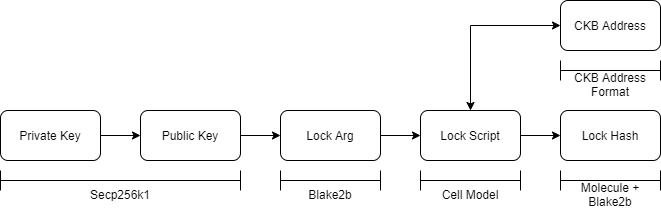
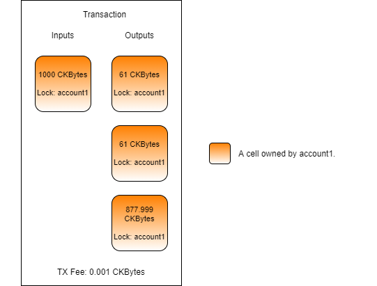
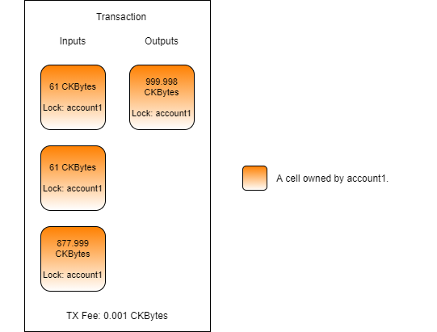

# Using the Default Lock Script

The "default lock script" is the most common method of securing cells on Nervos. The code binaries are included in the genesis block. All wallets and all of the available tooling readily support this lock. We have worked with the default lock in many of the previous examples and labs, but this time we will explain how it works in depth.

The default lock script uses a combination of the [Secp256k1](https://en.bitcoin.it/wiki/Secp256k1) and [Blake2b](https://en.wikipedia.org/wiki/BLAKE_%28hash_function%29#BLAKE2) algorithms. Secp256k1 is the same algorithm used in Bitcoin and Ethereum to provide private/public key signature functionality. Blake2b is a hashing algorithm that is also used by projects like Cardano and Sia. The combination of locking using Secp256k1 signatures and Blake2b hashing is also referred to as "Secp256k1-Blake2b-Sighash", or simply the "Sighash".

### Usage in Lumos

Open the `index.js` file from the `Using-the-Default-Lock-Script-Example` directory. If you scroll down to the bottom and find the `main()` function you will see that there are three main sections.


1. Initialize - In the first three lines of code in `main()`, we initialize the Lumos configuration, start the Lumos Indexer, and initialize the lab environment.
2. Create Cells - The `createDefaultLockCell()` function creates cells that use the default lock.
3. Consume Cells - The `consumeDefaultLockCell()` function consumes the cells with the default lock that we just created.

There is no section for deploying code this time. This is because the default lock a well-known script, and it is already deployed to the blockchain in the genesis block.

### Creating Cells Using the Default Lock

Starting near the top of `index.js` we have the following definitions.

```javascript
// This is the private key, lock arg, and address which will be used.
const privateKey1 = "0x67842f5e4fa0edb34c9b4adbe8c3c1f3c737941f7c875d18bc6ec2f80554111d";
const lockArg1 = "0x988a9c3e74c09dab76c8e41d481a71f4d36d772f";
const address1 = "ckt1qyqf3z5u8e6vp8dtwmywg82grfclf5mdwuhsggxz4e";
```

Provided is a private key and the corresponding lock arg and address for that private key. All three of these values are directly related to each other. It's important to know the relationship between all of the values used in order to understand how the default lock works on Nervos.

The private key is a randomly generated 256-bit value \(32 bytes\). This is can be used with the Secp256k1 algorithm to derive a 264-bit public key \(33 bytes\). Below is how this would be done in pseudo-code.

```javascript
privateKey = "0x67842f5e4fa0edb34c9b4adbe8c3c1f3c737941f7c875d18bc6ec2f80554111d";
publicKey = derive_secp256k1_public_key(privateKey);
print(publicKey);
>> 0x02fdd2f22bb7605479655ef1fc7f55699d5002712cbc7417e3e4a4c86274e709e4
```

Now that we have the public key, we can create a lock arg. As we mentioned earlier, a lock arg is a 160-bit Blake2b hash of the public key. Specifically, it is a 256-bit Blake2b hash, with the personalization key `ckb-default-hash`, truncated to 160 bits. Below is the pseudo-code to represent this.

```javascript
privateKey = "0x67842f5e4fa0edb34c9b4adbe8c3c1f3c737941f7c875d18bc6ec2f80554111d";
publicKey = derive_secp256k1_public_key(privateKey);
lockArg = truncate(blake2b(publicKey, 256, "ckb-default-hash"), 160);
print(lockArg);
>> 0x988a9c3e74c09dab76c8e41d481a71f4d36d772f
```

The "lock arg" was given its name because it is used in the `args` field of the default lock script to identify the owner of a cell. It is derived from the public key, and therefore it can provide proof of ownership. This process of hashing the public key is similar to Bitcoin's [Pay-to-PublicKey-Hash \(P2PKH\)](https://en.bitcoinwiki.org/wiki/Pay-to-Pubkey_Hash), but it uses different algorithms.

```javascript
privateKey = "0x67842f5e4fa0edb34c9b4adbe8c3c1f3c737941f7c875d18bc6ec2f80554111d";
publicKey = derive_secp256k1_public_key(privateKey);
lockArg = truncate(blake2b(publicKey, 256, "ckb-default-hash"), 160);
lockScript = {
                  "code_hash": "0x9bd7e06f3ecf4be0f2fcd2188b23f1b9fcc88e5d4b65a8637b17723bbda3cce8",
                  "hash_type": "type",
                  "args": lockArg
             };
```

The `code_hash` value you see in the lock script above is for the default lock on a local development blockchain. The default lock requires the lock arg to be used as the `args` value of the lock script. It is always important to make sure that the formatting of the data in the `args` matches the requirements of the lock that is being used. Failure to do so would result in the cell being unlockable, and the assets contained within the cell would be lost.

```javascript
privateKey = "0x67842f5e4fa0edb34c9b4adbe8c3c1f3c737941f7c875d18bc6ec2f80554111d";
publicKey = derive_secp256k1_public_key(privateKey);
lockArg = truncate(blake2b(publicKey, 256, "ckb-default-hash"), 160);
lockScript = {
                  "code_hash": "0x9bd7e06f3ecf4be0f2fcd2188b23f1b9fcc88e5d4b65a8637b17723bbda3cce8",
                  "hash_type": "type",
                  "args": lockArg
             };
lockHash = blake2b(serialize(lockScript), 256, "ckb-default-hash");
print(lockHash);
>> 0x6ee8b1ea3db94183c5e5a47fbe82110101f6f8d3e18d1ecd4d6a5425e648da69
```

A lock hash is a 256-bit Blake2b hash of the lock script after it has been serialized to binary.  All three values of the lock script are required to describe the ownership of a cell. The lock hash is a single value that can represent all three values in a shorter form.

The [Molecule](https://github.com/nervosnetwork/molecule) library is used by Nervos for most binary serialization operations. It is a serialization format that is similar to Google's Protocol Buffers, but designed specifically for the requirements of blockchain. Dapp frameworks like Lumos provide abstractions for serialization, so it is rare that you will have to use Molecule directly.

The lock hash is a format that a CKB node indexes internally, and it's often used with the RPC and tooling. Writing a cell collection query for cells with a specific lock script always requires all three values. This is because all three must be provided in order to generate the lock hash which can then be located by the CKB node.

```javascript
privateKey = "0x67842f5e4fa0edb34c9b4adbe8c3c1f3c737941f7c875d18bc6ec2f80554111d";
publicKey = derive_secp256k1_public_key(privateKey);
lockArg = truncate(blake2b(publicKey, 256, "ckb-default-hash"), 160);
lockScript = {
                  "code_hash": "0x9bd7e06f3ecf4be0f2fcd2188b23f1b9fcc88e5d4b65a8637b17723bbda3cce8",
                  "hash_type": "type",
                  "args": lockArg
             };
lockHash = blake2b(serialize(lockScript), 256, "ckb-default-hash");
address = ckb_address_encode(serialize(lockScript));
print(address);
>> ckt1qyqf3z5u8e6vp8dtwmywg82grfclf5mdwuhsggxz4e
```

An address on Nervos is a lock script that has been serialized with Molecule and encoded using the [CKB address format](https://github.com/nervosnetwork/rfcs/blob/master/rfcs/0021-ckb-address-format/0021-ckb-address-format.md). An address is a single value that represents all three fields of a lock script, similar to a lock hash. However, unlike a lock hash, an address is a human-readable format that includes a checksum to prevent typos and it is reversible back to a lock script since it is an alternate encoding of the data, not a hash of the data.



The above image shows the relationship between these values. All the values are ultimately derived from the initial private key and are used to represent ownership in different ways.

Now let's continue through the relevant parts of the `createDefaultLockCell()` function.

```javascript
// Create a cell using the default lock script.
const outputCapacity1 = intToHex(ckbytesToShannons(61n));
const output1 = {cell_output: {capacity: outputCapacity1, lock: addressToScript(address1), type: null}, data: "0x"};
transaction = transaction.update("outputs", (i)=>i.push(output1));

// Create a cell using the default lock script, but expanded this time.
const outputCapacity2 = intToHex(ckbytesToShannons(61n));
const lockScript2 =
{
	code_hash: "0x9bd7e06f3ecf4be0f2fcd2188b23f1b9fcc88e5d4b65a8637b17723bbda3cce8",
	hash_type: "type",
	args: lockArg1
}
const output2 = {cell_output: {capacity: outputCapacity2, lock: lockScript2, type: null}, data: "0x"};
transaction = transaction.update("outputs", (i)=>i.push(output2));
```

This code is creating two identical output cells, but the lock script is shown in two different ways. The first method uses the Lumos function `addressToScript()` to convert the address to a lock script. The second method fully defines a lock script. Both lock scripts in this code are identical and use the default lock script.

```javascript
// Create a change cell for the remaining CKBytes.
const outputCapacity3 = intToHex(inputCapacity - outputCapacity - txFee);
const output3 = {cell_output: {capacity: outputCapacity3, lock: addressToScript(address1), type: null}, data: "0x"};
transaction = transaction.update("outputs", (i)=>i.push(output3));
```

This block of code creates a change cell for the transaction. There isn't anything special about this code, but it's being pointed out because we're going to use this output later on.

```javascript
// Return the out points for outputs 1-3.
const defaultLockCellOutPoints =
[
	{tx_hash: txid, index: "0x0"},
	{tx_hash: txid, index: "0x1"},
	{tx_hash: txid, index: "0x2"}
];
return defaultLockCellOutPoints;
```

This block of code returns an array of the outputs which were created in this transaction. We created two outputs and a change cell, and we're going to consume all three in the next function.

Our resulting transaction will look like this.



### Consuming Cells Using the Default Lock

Next, we'll go through the relevant parts of the `consumeDefaultLockCells()` function.

```javascript
// Get a live cell for each out point and add to the transaction.
for(const outPoint of defaultLockCellOutPoints)
{
	const input = await getLiveCell(nodeUrl, outPoint);
	transaction = transaction.update("inputs", (i)=>i.push(input));	
}

// Get the capacity sum of the inputs.
const inputCapacity = transaction.inputs.toArray().reduce((a, c)=>a+hexToInt(c.cell_output.capacity), 0n);

// Create a change Cell for the remaining CKBytes.
const changeCapacity = intToHex(inputCapacity - txFee);
let change = {cell_output: {capacity: changeCapacity, lock: addressToScript(address1), type: null}, data: "0x"};
transaction = transaction.update("outputs", (i)=>i.push(change));
```

This is the main block of cell logic, and the purpose should be fairly clear. We add the three cells from the previous create function, then combine them back into a single cell.



Combining cells is not absolutely necessary, but it's good practice for a dapp to perform maintenance on the cells it is managing to ensure the number of cells in use does not grow endlessly. Remember, every cell that exists has overhead capacity requirements. If the capacity is tied up in overhead then this value is not available for other purposes.

```javascript
// Add in the witness placeholders.
transaction = addDefaultWitnessPlaceholders(transaction);
```

This code adds the witness placeholders for the default lock to the transaction. We've used this code many times before, but we never went into detail about what it actually does.

In Bitcoin, the witness is the part of the transaction where data that is required to prove authorization is provided. In Nervos, this is expanded to include any data that is required for the transaction to succeed. Think of it like an args field for a transaction.

The witness is an array structure that can be populated with any data, but there is one general convention that should be followed for compatibility with the default lock script and with scripts in general: For every unique lock script, the witness should contain the data required by the lock, at the same index. The image below will help illustrate this.


In this transaction, Alice and Bob are sending CKBytes to Charlie. Alice has provided input cells at indexes 0 and 1. Since index 0 is the first occurrence of Alice's lock in the inputs, she must add her signature at index 0 of the witness. Index 1 also uses Alice's lock, but it's not the first occurrence, so no data is needed. Bob has input cells at indexes 2 and 3. Index 2 is the first occurrence of Bob's lock in the inputs, so he must add his signature at index 2 of the witness. However, Bob cannot add his signature at index 2 unless there is something at index 1. To align the indexes properly, an empty value is added to the witness at index 1. An empty value could also be added to the witness at index 3, but this is optional.

Now that we understand the basic witness structure conventions, let's take a look at what `addDefaultWitnessPlaceholders()` is doing under the hood.

```javascript
/**
 * Adds witness placeholders to the transaction for the default lock.
 * 
 * This function assumes all cells use the default lock. If a cell is not using
 * the default lock, the placeholder may need to be altered after this function
 * is run. This function can only be used on an empty witnesses structure.
 * 
 * @param {Object} transaction An instance of a Lumos `TransactionSkelton`.
 * 
 * @return {Object} An instance of the transaction skeleton with the placeholders added.
 */
function addDefaultWitnessPlaceholders(transaction)
{
	if(transaction.witnesses.size !== 0)
		throw new Error("This function can only be used on an empty witnesses structure.");

	// Cycle through all inputs adding placeholders for unique locks, and empty witnesses in all other places.
	let uniqueLocks = new Set();
	for(const input of transaction.inputs)
	{
		let witness = "0x";

		const lockHash = computeScriptHash(input.cell_output.lock);
		if(!uniqueLocks.has(lockHash))
		{
			uniqueLocks.add(lockHash);
			witness = "0x0000000000000000000000000000000000000000000000000000000000000000000000000000000000000000000000000000000000000000000000000000000000";
		}

		witness = new Reader(core.SerializeWitnessArgs(normalizers.NormalizeWitnessArgs({lock: witness}))).serializeJson();
		transaction = transaction.update("witnesses", (w)=>w.push(witness));
	}

	return transaction;
}
```

This library function adds placeholder values to the witness specifically for the default lock script. At the first occurrence of each unique lock script, it adds a zero-filled placeholder. At every other index, it adds an empty value.

On line 21 you see the empty value, which is just a plain hex string. On line 29 you see the zero-filled placeholder. It is exactly 65 bytes long, which is the length required by a Secp256k1 signature.

On lines 30 and 31, the `witness` value is added to another structure called `WitnessArgs`. This is a structure that divides the witness entry into three components: `lock`, `input_type`, and `output_type`. The `lock` is reserved for lock scripts, and that is what is relevant to us since we're dealing with a lock script. The other two are reserved for the inputs and outputs on a type script, which will be covered in a later lesson.

The placeholder length of 65 bytes and the usage of the `WitnessArgs` structure to encapsulate our witness entries are specific requirements of the default lock. As we mentioned earlier, the witness allows any kind of data to be placed in it, but the default lock requires specific formatting.

Placeholders are put into the witness instead of signatures because this is required to generate the signing message for the transaction in a predictable way. This will be more apparent once we look at how the default lock script works. Below is the default lock script in pseudo-code.

```javascript
function main()
{
    hasher = blake2b_init(256, "ckb-default-hash");

    txHash = load_tx_hash();
    hasher.update(txHash);

    witnessGroup = load_witness_group();
    witnessGroupWithPlaceholders = replace_signatures_with_placeholders(witnessGroup);

    for(witness in witnessGroupWithPlaceholders)
    {
        hasher.update(lenth(witness));
        hasher.update(witness);
    }
    
    witnessAuxiliary = load_witness_auxiliary();

    for(witness in witnessAuxiliary)
    {
        hasher.update(lenth(witness));
        hasher.update(witness);
    }
    
    message = hasher.finalize();
    signature = witnessGroup[0].lock;
    publicKey = secp256k1_recover(signature, message);

    lockArg = truncate(blake2b(publicKey, 256, "ckb-default-hash"), 160);
    scriptArgs = load_script_args();

    if(lockArg == scriptArgs[0..20])
    {
        return 0;
    }
    else
    {
        return 1;
    }
}
```

This code would execute on-chain to validate ownership of a cell. This is done by comparing the owner that is specified in the lock script args to the signature that is provided in the witness. Let's walk through it to understand how this is performed.

Starting on line 3, we initialize a Blake2b hasher which will be populated with elements of the transaction. This will be used to generate the signing message for the transaction. It is being generated directly from the contents of the transaction since this is the only way to ensure the nothing has been changed after the signature was provided.

On lines 5-6, we load the current transaction hash and add it to the hasher. The tx hash is a Blake2b hash of the populated transaction structure which includes all inputs and outputs. Adding this ensures that nothing has been changed within these structures. 

On line 8 we load the witness group. A witness group is the corresponding witnesses for inputs that have the same lock script as the one that is currently executing. Let's look at the transaction image again to better understand what this means.


When the lock script for Alice executes, the input group will include input cell index 0 and 1. Input cells 2 and 3 would not be included because the details of their lock script are different. The witness group for Alice would then be witnesses 0 and 1 because this matches the indexes for the input group. When the lock script for Charlie executes, the input group would include the cells at index 2 and 3. The witness group for Charlie would include only the witness at index 2 because no extra empty data was provided.

On line 9 we take our witness group and we replace the signatures with zero-filled placeholders. This is done because a signing message has to be generated from this structure, and you can't include the real signatures since those are generated from the signing message.

On lines 11 to 15, we cycle through each placeholder witness and add it to the hash. This ensures that the witness data withness the witness group has not been modified after signing.

On lines 17 to 23, we cycle through each auxiliary witness and add it to the hash. An auxiliary witness is any witness data that exists at witness indexes beyond the maximum input cell index. In the transaction image, this would be if data was included in the witness at indexes of 4 or higher. This ensures that the auxiliary witness data has not changed if it exists. The default lock does not use auxiliary witness data for any purpose, but other lock scripts or type scripts may choose to use this data area for their own purposes. 

On line 25, we finalize the hash to generate the signing message for the transaction.

On line 26, we extract the provided signature. This is expected to be in the first cell of the witness group, which contains a WitnessArgs structure, of which the `lock` contains the data we need.

On line 27, we use the Secp256k1 recovery function to get the original public key. This is only possible when you have a signature that was created with the corresponding private key, and the original signing message. Only if all of this is correct will the proper public key be recovered.

On line 29, we calculate the lock arg from the public key that was recovered.

On line 30, we extract the `args` data from the lock script. This is expected to be the lock arg of the owner.

On lines 32 to 39, we compare the lock arg that was generated by the transaction data and the signature to the first 160-bits of the lock scripts `args` field, which is expected to be the lock arg of the owner. If they match, then the cell will return success and unlock.

Our pseudo-code should be sufficient for gaining an understanding of the process, but it is simplified from the real implementation which is written in C. If you want to read through the real implementation, you can view the production source code on [GitHub](https://github.com/nervosnetwork/ckb-system-scripts/blob/master/c/secp256k1_blake160_sighash_all.c), but this is purely optional. We will be covering the writing of on-chain scripts in much more detail in the next lesson.

```javascript
// Sign the transaction.
const signedTx = signTransaction(transaction, privateKey1);
```

This code adds signs the transaction with a private key. We've also used this code many times before, but let's look at the source in the shared library to see what it is actually doing.

```javascript
/**
 * Sign a transaction that uses the default lock and requires a single signature.
 * 
 * @param {Object} transaction An instance of a Lumos transaction skeleton.
 * @param {String} privateKey A 256-bit Secp256k1 private key represented as a hex string.
 * 
 * @return {Object} An instance of a Lumos transaction that has been sealed.
 */
function signTransaction(transaction, privateKey)
{
	transaction = secp256k1Blake160.prepareSigningEntries(transaction);
	const signingEntries = transaction.get("signingEntries").toArray();
	const signature = signMessage(privateKey, signingEntries[0].message);
	const tx = sealTransaction(transaction, [signature]);

	return tx;
}
```

On lines 11 to 12, we are generating the signing entries for the default lock script. A signing entry is another name for the signing message. Multiple signing entries may get generated by a single transaction.

Looking back at the transaction image from earlier, there are two unique lock scripts for Alice and Bob. Both lock scripts are using the default lock, but they use a different lock arg since they are for different users. This would generate two different signing entries, one which must be signed by Alice, and one that must be signed by Bob.

On line 13, we sign the first generated message using the provided private key. The `signMessage()` function is also from the shared library.

```javascript
/**
 * Creates a signature for the provided message with the provided private key using the Secp256k1 algorithm. 
 * 
 * @param {String} privateKey A 256-bit Secp256k1 private key represented as a hex string.
 * @param {String} message A message to sign represented as a hex string.
 * 
 * @return {String} A 65 byte Secp256k1 signature represented as a hex string.
 */
function signMessage(privateKey, message)
{
	const messageArray = new Uint8Array(new Reader(message).toArrayBuffer());
	const pkArray = new Uint8Array(new Reader(privateKey).toArrayBuffer());
	const {signature, recid} = secp256k1.ecdsaSign(messageArray, pkArray);
	const array = new Uint8Array(65);
	array.set(signature, 0);
	array.set([recid], 64);

	return new Reader(array.buffer).serializeJson();
}
```

This function has some particular details to it, but what it is accomplishing should be fairly straight forward. You provide a private key and a message, then it signs the message with the private key and returns the signature.

Going back to the previous code example, on line 14 we seal the transaction. As parameters, it takes a Lumos transaction skeleton and an array of signatures. The signatures are placed into the witness structure, replacing the zero-filled placeholders.

After the sealing step is completed, the transaction can no longer be changed. Doing so would invalidate the signatures that were added. The transaction is ready to be sent to the CKB node to be broadcasted to the network.

The `signTransaction()` shared library function is designed to sign transactions that only use the default lock and only require a single signature. This is useful because this is a very common scenario, but this function will not work if more than one signature is required, or something other than the default lock script is used. For example, the transaction image from earlier with Alice and Bob would not work with this function since it requires two signatures.


