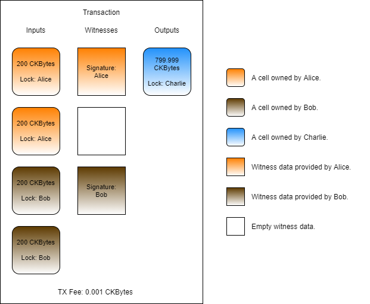
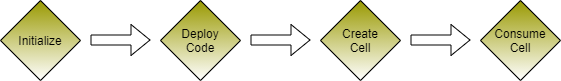

# Using a Witness

In Nervos, there is a data structure called "witnesses" which is the part of the transaction that is designated to hold signature data \(also known as witness data\). This is similar to the [witness data structure in Bitcoin](https://github.com/bitcoin/bips/blob/master/bip-0141.mediawiki). Nervos extends the usage of the witness beyond signatures, to include any data which is needed by the transaction to confirm.

A witness is similar to the `args` field of a script, but it is distinctly different in several ways.

* The scope of a witness is a transaction instead of a script on a single cell.
* The data contained within a witness is still part of the blockchain, but it is not part of the state, and therefore doesn't require state rent.
* A witness is the part of the transaction that specifically takes into account the design considerations required for signatures.

The most common usage for a witness is to hold the signatures required by the transaction, but can also be used for more advanced functionality which we will cover in later lessons. In the most simple sense, witnesses are like an `args` field for the transaction.

### How Witnesses are Structured

Witnesses is a top-level part of a transaction, just like inputs, outputs, and cell deps. Similarly, witnesses are also segmented the same way, in an array-like structure. This allows the data in the witness to be matched with inputs and outputs more easily since they both have a similar structure.

Below is a line of code that has been used frequently in our examples. 

```javascript
// Add in the witness placeholders.
transaction = addDefaultWitnessPlaceholders(transaction);
```

This code adds witness placeholders for the default lock to the transaction. We've used this code many times before, but we never went into detail about what it actually does.

Witnesses is an array structure that can be populated with any data, but there is one general convention that should be followed for compatibility with the default lock script and with scripts in general: For every unique lock script, the witnesses structure should contain the data required by the lock at the same index. The image below will help illustrate this.



In this transaction, Alice and Bob are sending CKBytes to Charlie. Alice has provided input cells at indexes 0 and 1. Since index 0 is the first occurrence of Alice's lock in the inputs, she must add her signature at index 0 of the witnesses structure. Index 1 also uses Alice's lock, but it's not the first occurrence, so no data is needed. Bob has input cells at indexes 2 and 3. Index 2 is the first occurrence of Bob's lock in the inputs, so he must add his signature at index 2 of the witnesses structure. However, Bob cannot add his signature at index 2 unless there is something at index 1. To align the indexes properly, an empty value is added to the witness at index 1. An empty value could also be added to the witness at index 3, but this is optional.

Now that we understand the basic witness structure convention, we can safely use the witnesses structure. The `addDefaultWitnessPlaceholders()` function follows this basic convention and adds in signature placeholders in the places where signatures are required for the default lock. We will dig into the details of the default lock later on and explain why placeholders are needed, but for now we will treat witnesses like a basic array and use it with a more simple lock script example.

### Using a Witness to Provide Proof Data

It is most common to provide signatures in the witnesses structure, but it can be used to provide any form of data to the transaction. We can use a witness to provide proof data to a transaction that isn't a signature.

Let's take a look at a lock that uses a Blake2b hash to secure a cell, and unlocks when the preimage is provided. We will call this the "Hash Lock" going forward. The pseudo-code below describes this.

```javascript
function main()
{
    lock_args = load_lock_args();
    hash = lock_args[0..32];

    witnessGroup = load_witness_group();
    preimage = witnessGroup[0];

    if(hash == blake2b(preimage)))
    {
        return 0;
    }
    
    return 1;
}
```

On lines 3 and 4, we load the hash from the lock script args. This is a 256-bit hash, which is 32 bytes of data.

On lines 6 and 7, we load the preimage from the witness. Earlier we said, "For every unique lock script, the witnesses structure should contain the data required by the lock at the same index." This is fulfilling that requirement and loading the data we need from the expected witness index. We're using something called a "witness group" here, which we will describe below. 

A witness group is the corresponding witnesses for inputs that have the same lock script as the one that is currently executing. Let's look at the transaction image again to better understand what this means.


When the lock script for Alice executes, the input group will include input cell index 0 and 1. Input cells 2 and 3 would not be included because the details of their lock script are different. The witness group for Alice would then contain witnesses 0 and 1 because this matches the indexes for the input group. When the lock script for Bob executes, the input group would include the cells at index 2 and 3. The witness group for Bob would include only the witness at index 2 because there is no value at index 3.

Alice's `witnessGroup[0]` value would match witnesses index 0, which is Alice's signature. Bob's`witnessGroup[0]` value would match witnesses index 2, which is Bob's signature.

On lines 9 to 14, we hash our preimage as a Blake2b 256-bit hash, then check if it matches the hash in the `args`. If it is a match, we unlock the cell, otherwise, we return an error.

This code is an example of how to use witnesses to provide proof data to unlock a cell, but this exact lock should never be used outside of a test environment. This code allows anyone who knows the preimage key to unlock any cell secured with the same hash. Unlocking any cell will reveal the preimage in the blockchain, leaving any remaining locked cells using the same hash vulnerable to being stolen.

### Usage in Lumos

Next, we will use the Hash Lock in a Lumos transaction example. Our code will deploy the lock, create some cells using the Hash Lock, then consume those cells that we just created to reclaim that capacity.

The code we will be covering here is located in the `index.js` file in the `Using-a-Witness-Example` directory. Feel free to open the `index.js` file and follow along. This code example is fully functional. You can execute this code in a console by entering the directory and executing `node index.js`.

Starting with the `main()` function, you will see our code has the usual four sections.



The initialization and deployment code is nearly identical to the previous examples, so we're not going to go over it here. Feel free to review that code on your own if you need a refresher.

### Creating the Hash Lock Cells

Near the top of `index.js` you will see this line.

```javascript
// This is the preimage which will be used to lock and unlock our cells.  
const preimage = "0x4f70656e20536573616d65"; // "Open Sesame"
```

This is the preimage data that we will use to generate our hash. This must remain a secret since anyone who knows the preimage would be able to unlock the cell.

Next, we will look at the relevant parts of the `createCellsWithHashLock()` function. This function generates and executes a transaction that will create cells using the Hash Lock.

```javascript
// Create cells using the Hash Lock.
const outputCapacity1 = ckbytesToShannons(500n);
const lockScript1 =
{
	code_hash: dataFileHash1,
	hash_type: "data",
	args: blake2b(32).update(preimage).digest("hex")
};
const output1 = {cell_output: {capacity: intToHex(outputCapacity1), lock: lockScript1, type: null}, data: "0x"};
transaction = transaction.update("outputs", (i)=>i.concat([output1, output1]));
```

This is the code that creates the cells using the Hash Lock. This code should look very similar to the code we have used in previous examples. There is only one line that is important enough to point out.

On line 7, we add a hash of our preimage to the `args` of the lock script. We are using the 256-bit Blake2b algorithm both here and in the lock. This hash will be fully visible on-chain, but the preimage is required to unlock it, and that is still a secret.

If you look closely at line 10, you will notice that we are adding `output1` to the transaction two times, therefore creating two cells using the Hash Lock.

Our resulting transaction should look similar to this.


### Consuming the Hash Lock Cells

Next, we will look at the relevant parts of the `consumeCellsWithHashLock()` function. This function generates and executes a transaction that will consume the cells we just created that use the Hash Lock.

```javascript
// Add the Hash Lock cells to the transaction.
const capacityRequired1 = ckbytesToShannons(1_000n);
const lockScript1 =
{
	code_hash: dataFileHash1,
	hash_type: "data",
	args: blake2b(32).update(preimage).digest("hex")
};
const collectedCells = await collectCapacity(indexer, lockScript1, capacityRequired1);
transaction = transaction.update("inputs", (i)=>i.concat(collectedCells.inputCells));
```

Here we add the Hash Lock cells to the transaction. We are using the `collectCapacity()` library function to locate the cells. The lock script we specify is exactly the same as when we created the cells in the previous function, which ensures we get the exact same kind of cells. Specifying the `capacityRequired` as 1,000 CKBytes should pull in the two cells we just created which were each 500 CKBytes.

```javascript
// Add in the witness placeholders.
// transaction = addDefaultWitnessPlaceholders(transaction);

// Sign the transaction.
// const signedTx = signTransaction(transaction, privateKey1);

// Add our preimage to the witnesses.
transaction = transaction.update("witnesses", (w)=>w.push(preimage));
```

Just like our previous example, we are skipping the placeholders and signing because only the OCC Lock cells were used as inputs and the OCC Lock does not check signatures. Instead, we add our preimage directly to the witnesses structure. This will be located at index 0.

Our resulting transaction will look like this.


The preimage is in the witnesses at index 0. As we explained earlier, this the same index as the first occurrence of the OCC Lock in the inputs, which means it is also the first index of the witness group, `witnessGroup[0]`. This will allow the OCC Lock to locate the data quickly when it executes because it is in the expected location. 


