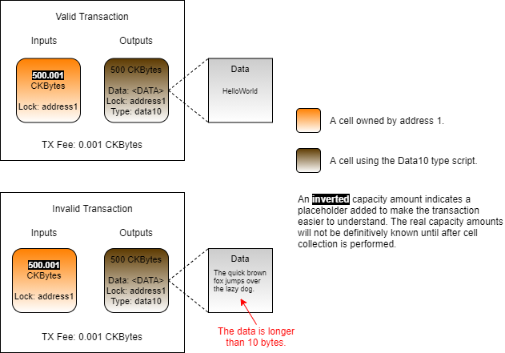

# Accessing Cell Data

Inspecting the data within cells is another common operation for evaluating the validity of a transaction. Next, we will create a cell that only allows a limited amount of data to be stored within it by using a type script.

The type script we use will read the data that the cell is being created with and validate the size of data as being 10 bytes or less. Trying to create a cell containing more than 10 bytes of data will result in the transaction being rejected. We will call this the "Data10" type script.



On the top left of the image is a transaction where the Data10 type script is used. The data area of the cell contains a string that is 10 bytes or less. If this cell were created in a transaction, meaning it was added as an output, the type script would execute without error and the transaction would process successfully.

On the bottom left is a similar transaction using the Data10 type script, but the data area contains a string much larger than 10 bytes. If this cell were put into a transaction as an output, the type script would execute and return an error. This transaction would be rejected.

### Script Logic

Next, we will look at the logic and code that would be used to create this type script.

Let's take a look at it in pseudo-code first to understand the logic.


```javascript
function main()
{
    current_script = load_current_script();

    outputs = load_outputs();
    for cell in outputs
    {
        if(cell.type == current_script)
        {
            if(cell.data.length() > 10)
            {
                return 1;
            }
        }
    }

    return 0;
}
```


On line 3, we load the currently executing script. This is needed for comparison later on.&#x20;

On line 5, we load the outputs. This will return all of the outputs in the current transaction we are validating.

On line 6, we begin iterating through each output cell.

On line 8, we check if the output cell's type script matches the currently executing script. We do this because we are only concerned with cells that use the same type script, but there could be other cells in the transaction. This is part of what is known as the the minimal concern pattern, which we will cover in more depth later. What's important to know now is that our script is only validating cells that have the Data10 type script.

On lines 10 to 13, we check the length of the data field. If it has data larger than 10 bytes, an error is returned.

On line 17, we return successfully after no errors are found.

Our code only checks the outputs, because that is when the cell is created. When the cell is used as an input, we don't need to check again. This is because we already checked when the cell was created, and cells are immutable once created. However, it would also be acceptable to validate all the Data10 cells in the inputs in addition to the outputs. This would consume slightly more cycles, but it is acceptable as a security precaution.

Now let's look at the real version of the Data10 type script, written in Rust. This is located in the `entry.rs` file in`developer-training-course-script-examples/contracts/data10/src`.


```rust
// Import from `core` instead of from `std` since we are in no-std mode.
use core::result::Result;

// Import CKB syscalls and structures.
// https://nervosnetwork.github.io/ckb-std/riscv64imac-unknown-none-elf/doc/ckb_std/index.html
use ckb_std::ckb_constants::Source;
use ckb_std::ckb_types::prelude::*;
use ckb_std::high_level::{load_cell, load_cell_data, load_script, QueryIter};

// Import our local error codes.
use crate::error::Error;

// Constants.
const MAX_DATA_SIZE: usize = 10;

// Main entry point.
pub fn main() -> Result<(), Error>
{
    // Load the current script.
    let script = load_script()?;
    
    // Load each cell from the outputs.
    for (i, cell) in QueryIter::new(load_cell, Source::Output).enumerate()
    {
        // Check if there is a type script, and skip to the next cell if there is not.
        let cell_type_script = &cell.type_();
        if cell_type_script.is_none()
        {
            continue;
        }
        
        // Convert the scripts to bytes and check if they are the same.
        let cell_type_script = cell_type_script.to_opt().unwrap();
        if *script.as_bytes() == *cell_type_script.as_bytes()
        {
            // Load the cell's data.
            let data = load_cell_data(i, Source::Output)?;
            
            // If the data is larger than our limit.
            if data.len() > MAX_DATA_SIZE
            {
                // Return a limit exceeded error.
                return Err(Error::DataLimitExceeded);
            }
        }
    }
    
    Ok(())
}
```


Lines 1 to 11 are all imports of dependencies.

* The `core` library is an alternative to the Rust standard library that has some basic structures and types that work in `no_std` mode.
* The `ckb_std` library is the standard library used for developing Nervos scripts in Rust.
* Line 11 imports the custom error codes we have created for our script.

On line 14, we set a constant for the maximum amount of data, 10 bytes.

On line 20, we load the currently executing script so we can compare it against each cell.

On line 23, we are using`QueryIter()` to iterate through each loaded cell from the outputs. This removes the need for the extra code to check for errors like `IndexOutOfBound`. In most cases, if you have the option to use `QueryIter()`, you probably want to use it. On top of the iterator we use `enumerate()` so we can also track the current loop iteration in the `i` variable. This is optional, but we will need it later on.

On lines 26 to 30, we check if the current cell has a type script. Remember, a type script is optional on a cell. If there is no type script, we continue to the next cell.

On lines 33 and 34 we check if the cell's type script matches the currently executing type script. The outputs could contain multiple different cells, and we are only concerned with Data10 cells.

On line 37, we load the cell's data. We use the `i` variable to ensure we load data from the same index position in the outputs.

On lines 40 to 44, we check the length of the data. If the data is longer than 10, we return the error `DataLimitExceeded`.

On line 48, if no errors were detected in any of the Data10 cells, we return success.

### Usage in Lumos

Next, we will use the Data10 type script in a Lumos example. Our code will deploy the binary, create some cells using the Data10 script, then consume those cells that we just created to reclaim that capacity.

The code we will be covering here is located in the `index.js` file in the `Accessing-Cell-Data-Example` directory. Feel free to open the `index.js` file and follow along. This code example is fully functional, and you should feel free to modify and experiment with it. You can execute this code in a console by entering the directory and executing `node index.js`.

Starting with the `main()` function, you will see our code has the usual four sections.


The initialization and deployment code is nearly identical to the previous examples, so we're not going to go over it here. Feel free to review that code on your own if you need a refresher.

### Creating Cells

Next, we will look at the relevant parts of the `createCells()` function. This function generates and executes a transaction that will create cells using the Data10 type script.


```javascript
// Add the cell deps for the default lock script and Data10 type script.
transaction = addDefaultCellDeps(transaction);
const cellDep = {depType: "code", outPoint: data10CodeOutPoint};
transaction = transaction.update("cellDeps", (cellDeps)=>cellDeps.push(cellDep));
```


This is the code that adds cell deps to the transaction. On line 2, the cells deps are added for the default lock. On lines 3 and 4, the cell dep is added for the Data10 type script. Type scripts execute both on inputs and outputs, so a cell dep is always needed.


```javascript
// Create cells using the Data10.
const messages = ["HelloWorld", "Foo Bar", "1234567890"];
for(const message of messages)
{
    const outputCapacity1 = ckbytesToShannons(500n);
    const lockScript1 = addressToScript(address1);
    const typeScript1 =
    {
        codeHash: dataFileHash1,
        hashType: "data",
        args: "0x"
    };
    const data1 = stringToHex(message);
    const output1 = {cellOutput: {capacity: intToHex(outputCapacity1), lock: lockScript1, type: typeScript1}, data: data1};
    transaction = transaction.update("outputs", (i)=>i.push(output1));
}
```


This is the code logic that creates the cells that use the Data10 type script. It uses the `messages` provided on line 2, then loops through them creating three cells with the different data.

On lines 7 to 12, we define the type script for the cell. The syntax for this is the same as when we created lock scripts in the past, but it is added as the `type` instead of the `lock` when we generate the cell structure on line 14.

On line 13, we convert our message to a hex string, and then add it to the structure on line 14.&#x20;

The resulting transaction will look similar to this. We are creating three cells using the Data10 type script, and all are the same except for the data contained within.&#x20;


### Consuming

Next, we will look at the relevant parts of the `consumeCells()` function. This function generates and executes a transaction that will consume the cells we just created that use the Data10 type script.

```javascript
// Add the cell deps for the default lock script and Data10 type script.
transaction = addDefaultCellDeps(transaction);
const cellDep = {depType: "code", outPoint: data10CodeOutPoint};
transaction = transaction.update("cellDeps", (cellDeps)=>cellDeps.push(cellDep));
```

Just like with the creation function, we add cell deps for the default lock script and the Data10 type script. The cells we created use the Data10 type script, but they are secured by the default lock. Both will execute on the inputs, so both require cell deps.


```javascript
// Add the Data10 cells to the transaction. 
const lockScript1 = addressToScript(address1);
const typeScript1 =
{
		codeHash: dataFileHash1,
		hashType: "data",
		args: "0x"
};
const query = {lock: lockScript1, type: typeScript1};
const cellCollector = new CellCollector(indexer, query);
for await (const cell of cellCollector.collect())
		transaction = transaction.update("inputs", (i)=>i.push(cell));
```


Here we add the cells with the Data10 type script to the transaction. Just like the previous example, we use the `CellCollector()` with the same lock script and type script that we created the cell with.

On lines 9, we specify the `lock` and `type`. We could also specify `data` here, but then we would have to use three different queries to locate our cells. We're more interested in using a single query to find all the cells we're interested in.

On lines 11 and 12, we add all the cells found to the transaction. This will add the three cells we created, but if there were more cells it would continue to loop, adding them all.

The resulting transaction will look similar to this.

.png>)

A type script executes on both inputs and outputs, so the Data10 type script will execute here. It will query the output group, but it won't find anything. There is one output, but that doesn't have the same type script, so it will not be included when the output group is queried. Since there are no Data10 cells to validate, it will exit with success, allowing the cells to be consumed.
