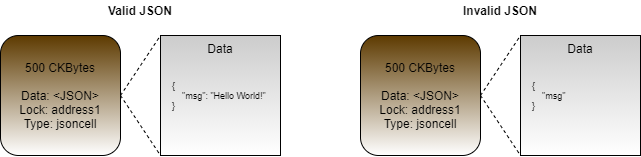

# Creating a JSON Storage Cell

Using a type script, we can create a cell that only allows valid JSON strings to be stored in it. Any time a cell is created, the type script will read the data that the cell is being created with and validate it as a JSON string. Trying to create a cell containing invalid JSON will result in the transaction being rejected. We will call this the "JSON Cell" type script.



On the left of the image is a cell that uses the `jsoncell` type script. The data area of the cell contains a valid JSON string. If this cell were put into a transaction as an output, meaning we are creating this cell, the type script would execute without error, allowing the transaction to proceed.

On the right is a similar cell using the `jsoncell` type script, but the data area contains invalid JSON. If this cell were put into a transaction as an output, the type script would execute and return an error. This transaction would be rejected.

### Script Logic

Next, we will look at the logic and code that would be used to create this type script.

Let's take a look at it in pseudo-code first to understand the logic.

```javascript
function main()
{
    outputGroup = load_output_group();
    for cell in outputGroup
    {
        if(!is_valid_json(cell.data))
        {
            return 1;
        }
    }

    return 0;
}
```

On line 3, we load the output group. When this is called from a type script, it includes only the output cells that have the same type script. The outputs could contain many different cells, but this script is only concerned with those using the `jsoncell` type script.

On lines 4 to 10, we cycle through every cell in the output group, checking the data field of each one. If any of them contain invalid JSON data, an error is returned immediately. We only check the outputs, because that is when the cell is created. When the cell is used as an input, we don't need to check again. This is because we already checked when the cell was created, and cells are immutable once created.

On line 12, we return successfully after no errors are found.

Now let's look at the real version of the type script, written in Rust. This is located in the `entry.rs` file within the directory `developer-training-course-scripts/contracts/jsoncell/src`.

```rust
// Import from `core` instead of from `std` since we are in no-std mode.
use core::result::Result;
use core::str;

// Import CKB syscalls and structures.
// https://nervosnetwork.github.io/ckb-std/riscv64imac-unknown-none-elf/doc/ckb_std/index.html
use ckb_std::ckb_constants::Source;
use ckb_std::high_level::{load_cell_data, QueryIter};

// Import the lite-json library for JSON parsing/validation.
use lite_json::json_parser::parse_json;

// Import our local error codes.
use crate::error::Error;

// Main entry point.
pub fn main() -> Result<(), Error>
{
    // Load the cell data from each cell.
    for data in QueryIter::new(load_cell_data, Source::GroupOutput)
    {
        // Parse the cell data into a UTF-8 string.
        let json_str = str::from_utf8(&data).map_err(|_| Error::InvalidStringData)?;
        
        // Validate the string as JSON by parsing it.
        parse_json(json_str).map_err(|_|Error::InvalidJson)?;
    }
    
    Ok(())
}
```

Lines 1 to 14 are all imports.

* The `core` library is an alternative to the Rust standard library that has some basic structures and types that work in `no_std` mode.
* The `ckb_std` library is the standard library used for developing Nervos scripts in Rust.
* The `lite_json` library is a `no_std` compatible JSON parser.
* Line 14 imports the custom error codes we have created for our script.

Lines 16 to 30 contain the main logic for our type script. The Rust syntax is a little more complex than our pseudo-code, but code flow is very similar, and the length of the code isn't much longer.

 On line 20, we use the `load_cell_data()` function to load cell data from the `GroupOutput` source. The `load_cell_data()` function can be used to load individual cells, but when combined with `QueryIter()` it can be used as a Rust `Iterator`, allowing us to cycle through all cells more easily.

On line 23, we parse the raw data into a UTF-8 string, and if an error occurs during decoding we trap the error and map it to `InvalidStringData`.

On line 26, we parse the UTF-8 encoded JSON string. If the string is invalid, we trap the error and map it to `InvalidJson`.

On line 29, if no errors were detected, we return success.

### Usage in Lumos

Next, we will use the JSON Cell type script in a Lumos example. Our code will deploy the lock, create some cells using the JSON Cell script, then consume those cells that we just created to reclaim that capacity.

The code we will be covering here is located in the `index.js` file in the `Creating-a-JSON-Storage-Cell-Example` directory. Feel free to open the `index.js` file and follow along. This code example is fully functional, and you should feel free to modify and experiment with it. You can execute this code in a console by entering the directory and executing `node index.js`.

Starting with the `main()` function, you will see our code has the usual four sections.


The initialization and deployment code is nearly identical to the previous examples, so we're not going to go over it here. Feel free to review that code on your own if you need a refresher.

### Creating Cells with the JSON Cell Type Script

Next, we will look at the relevant parts of the `createCellsWithJsonCellType()` function. This function generates and executes a transaction that will create cells using the JSON Cell type script.

```javascript
// Add the cell deps for the default lock script and JSON Cell type script.
transaction = addDefaultCellDeps(transaction);
const cellDep = {dep_type: "code", out_point: jsonCellCodeOutPoint};
transaction = transaction.update("cellDeps", (cellDeps)=>cellDeps.push(cellDep));
```

This is the code that adds cell deps to the transaction. On line 2, the cells deps are added for the default lock. On lines 3 and 4, the cell dep is added for the JSON Cell type script. You may remember from some of the previous lock script examples that we only added the cells deps for the default lock when we were creating cells. This is because lock scripts only execute on inputs, not outputs. When we are creating a cell we do not need a cell dep for the lock script because it doesn't execute. However, type scripts execute both on inputs and outputs, so a cell dep is always needed.

```javascript
// Create cells using the JSON Cell.
const messages = [{"msg": "Hello World!"}, ["Foo Bar"], 1234567890];
for(let message of messages)
{
	const outputCapacity1 = ckbytesToShannons(500n);
	const lockScript1 = addressToScript(address1);
	const typeScript1 =
	{
		code_hash: dataFileHash1,
		hash_type: "data",
		args: "0x"
	};
	const data1 = stringToHex(JSON.stringify(message));
	const output1 = {cell_output: {capacity: intToHex(outputCapacity1), lock: lockScript1, type: typeScript1}, data: data1};
	transaction = transaction.update("outputs", (i)=>i.push(output1));
}
```

This is the code logic that creates the cells that use the JSON Cell type script. It uses the `messages` provided on line 2, then loops through them creating three cells with the different messages.

On lines 7 to 12, we define the type script for the cell. The syntax for this is the same as when we created lock scripts in the past, but it is added as the `type` instead of the `lock` when we generate the cell structure on line 14.

On line 13, we JSON serialize our message, and then add it to the structure on line 14. 

The resulting transaction will look similar to this. We are creating three cells using the JSON Cell type script, and all are the same except for the data contained within. 


### Consuming Cells with the JSON Cell Type Script

Next, we will look at the relevant parts of the `consumeCellsWithJsonCellType()` function. This function generates and executes a transaction that will consume the cells we just created that use the JSON Cell type script.

```javascript
// Add the cell deps for the default lock script and JSON Cell type script.
transaction = addDefaultCellDeps(transaction);
const cellDep = {dep_type: "code", out_point: jsonCellCodeOutPoint};
transaction = transaction.update("cellDeps", (cellDeps)=>cellDeps.push(cellDep));
```

Just like with the creation function, we add cell deps for the default lock script and the JSON Cell type script. The cells we created use the JSON Cell type script, but they are secured by the default lock. Both will execute on the inputs, so both require cell deps.

```javascript
// Add the JSON Cell cells to the transaction. 
const lockScript1 = addressToScript(address1);
const typeScript1 =
{
	code_hash: dataFileHash1,
	hash_type: "data",
	args: "0x"
};
const query = {lock: lockScript1, type: typeScript1};
const cellCollector = new CellCollector(indexer, query);
for await (const cell of cellCollector.collect())
	transaction = transaction.update("inputs", (i)=>i.push(cell));
```

Here we add the cells with the JSON Cell type script to the transaction. Instead of using the `collectCapacity()` library function to locate the cells, we are using the `CellCollector()` directly. We're doing this because the `collectCapacity()` function allows us to specify the lock script, but not the type script. We want to query using both so we only collect cells that are owned by us and use that specific type script.

On line 9, we specify the `lock` and `type`. We could also specify `data` here, but then we would have to use three different queries to locate our cells. We're more interested in using a single query to find all the cells.

On lines 11 and 12, we add all the cells found to the transaction. This will add the three cells we created, but if there were more cells it would continue to loop, adding them all.

The resulting transaction will look similar to this.


A type script executes on both inputs and outputs, so the JSON Cell type script will execute here. It will query the output group, but it won't find anything. There is one output, but that doesn't have the same type script, so it will not be included when the output group is queried. Since there is no JSON to validate, it will exit with success, allowing the cells to be consumed. 

