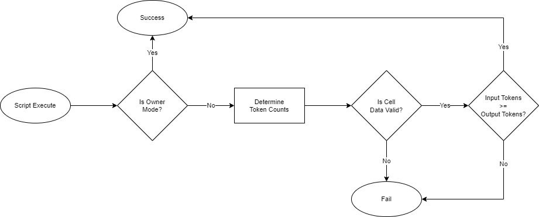

# Creating a Token

Tokens are one of the most common use cases for smart contracts today. As of 2021, there are over 400,000 different tokens that have been created on various platforms. In this lesson, we will learn how to create a basic token on Nervos.

To do this we will examine the SUDT standard, which stands for Simple User-Defined Token. SUDT is a minimalistic token standard, and the first official token standard to be released on Nervos. We use a Rust-based implementation that has specifically been formatted to be easier to read. The [official implementation](https://github.com/nervosnetwork/ckb-miscellaneous-scripts/blob/master/c/simple\_udt.c) is written in C, but reviewing it is purely optional.

### Script Logic

Next, we will look at a flow chart of the logic that that is used in the SUDT type script.



After script execution begins, the first step is to determine if it is running in owner mode. This is a form of operation detection which is used to check if the transaction is being executed by the user who created this token. If it is the owner of the token, then owner mode is enabled, and the script immediately exits successfully. This is the equivalent of a super-user mode, where all actions are permitted. If owner mode is not enabled, then validation continues.

The next step is to determine the total number of input tokens and the total number of output tokens. This is the total number of tokens in all of the inputs, and all of the outputs. To do this it must read the data of every token cell in the transaction, convert the data within the cell to a number, then tally the amounts to get totals for the inputs and outputs.

The next step is to check if the input tokens are greater than or equal to the output tokens. This single logical statement is the basis for enforcing the scarcity of the token. If the statement is not true, then there are more output tokens than there are input tokens. A user other than the owner may be trying to illegally mint tokens out of nothing. This would cause the script to immediately fail. If the statement is true, then the scarcity of the token is being preserved properly, and the script would exit successfully.

### Script Logic Implementation in Rust

Next, we will review the code of the Rust implementation of SUDT. We will look at one section at a time to make it easier to understand, but you can review the full source code at any time by opening the `entry.rs` file in the directory`developer-training-course-script-examples/contracts/sudt/src`.


```rust
// Import from core instead of from std since we are in no-std mode.
use core::result::Result;

// Import CKB syscalls and structures.
// https://nervosnetwork.github.io/ckb-std/riscv64imac-unknown-none-elf/doc/ckb_std/index.html
use ckb_std::ckb_constants::Source;
use ckb_std::ckb_types::{bytes::Bytes, prelude::*};
use ckb_std::high_level::{load_script, load_cell_lock_hash, load_cell_data, QueryIter};

// Import our local error codes.
use crate::error::Error;
```


This first block of code is the usual imports. Next, we have the definitions of the constants.


```rust
// Constants
const LOCK_HASH_LEN: usize = 32; // Number of bytes for a lock hash. (Blake2b 256-bit 32 bytes)
const SUDT_DATA_LEN: usize = 16; // SUDT uses a u128, which is 16 bytes.
```


The `LOCK_HASH_LEN` value is the number of bytes for a lock hash. This is a 256-bit (32 byte) Blake2b hash of a populated lock script structure. A unique hash value represents a unique lock script, or in more simple terms, it represents a unique owner. We will explain why this is important shortly.

The `SUDT_DATA_LEN` value is the number of bytes in a `u128`. This is an unsigned 128-bit value, which is 16 bytes in length. We will use a `u128` value to store the number of tokens in a cell. &#x20;

Next, we will skip down to the `main()` function and walk through the application in the order it would execute.


```rust
// Main entry point.
pub fn main() -> Result<(), Error>
{
    // Load the currently executing script and get the args.
    let script = load_script()?;
    let args: Bytes = script.args().unpack();
    
    // Check if the script is being run by the owner and immediately return success if true.
    if check_owner_mode(&args)?
    {
        return Ok(());
    }
    
    // Count the number of tokens in the GroupInput and GroupOutput.
    let input_token_amount = determine_token_amount(Source::GroupInput)?;
    let output_token_amount = determine_token_amount(Source::GroupOutput)?;
    
    // If the amount of input tokens is less than the amount of output tokens, return an error.   
    if input_token_amount < output_token_amount
    {
        return Err(Error::Amount);
    }
    
    // No errors were found during validation. Return success.
    Ok(())
}

```


On lines 4 to 6, we load the currently executing script, then extract the script args.

On lines 8 to 12, we check if owner mode is enabled. If it is enabled, the script immediately exits successfully.

On lines 14 to 16, we count the number of input tokens and output tokens from the `GroupInput` and `GroupOutput` sources.

On lines 18 to 22, we enforce the token's scarcity logic `input_tokens >= output_tokens`. If the statement is not true, then the script immediately exits with an error.

On lines 24 and 25, if no errors were found, then the script exits successfully.

The `main()` function has three mains sections:

1. Check if owner mode is enabled.
2. Determine the input and output token amounts.
3. Ensure that the token scarcity logic, `input_tokens >= output_tokens`, is enforced.

Starting with step 1, let's look at how `check_owner_mode()` is implemented.


```rust
/// Determine if owner mode is enabled.
fn check_owner_mode(args: &Bytes) -> Result<bool, Error>
{
    // Verify the the arguments length matches the length of a Blake2b hash.
    if args.len() != LOCK_HASH_LEN
    {
        return Err(Error::ArgsLength);
    }

    // Compare the Lock Script Hash from the script args with the Lock Scripts
    // of each input cell to determine if a match exists.
    let is_owner_mode = QueryIter::new(load_cell_lock_hash, Source::Input)
        .find(|lock_hash|args[..]==lock_hash[..]).is_some();

    // Return the owner mode status.
    Ok(is_owner_mode)
}
```


On lines 4 to 8, we check that the length of the script args. If the length of the args is not equal to `LOCK_HASH_LEN` (32 bytes), then the token cell was created with an invalid owner, and we return an error.

On lines 10 to 13, we check if owner mode is enabled. This is done by loading the lock hash from every input cell and checking if any of them match the lock hash that was specified in the script args when the cell was created. If any of them match, then owner mode is enabled, otherwise, owner mode is disabled.

All of the input cells in the transaction have a lock script, and all of these lock scripts must execute successfully for transaction to be successful. Therefore, our type script can assume that all input cells have been fully authorized and unlocked. When we search the input cells for a matching lock hash, we are checking if the owner of the token also authorized and unlocked one of the input cells.

Our type script is doing an **authorization piggyback**, by checking against a lock script hash. It is saying that owner mode is enabled if the owner of the token also authorized the use of one of the input cells. This pattern is an extremely efficient way of determining if the owner authorized this transaction because it reuses lock script logic that would be present anyway. The only requirement is that at least one input cell from the owner must be included in the transaction, and this is nothing out of the ordinary since at least one input cell is required in every transaction since someone has to pay the transaction fee.

The logic of the authorization piggyback can be difficult to grasp at first, but it is an important concept. We recommend that you take the time to fully understand this concept since it is essential to smart contract security.

On line 16, we return the detected owner mode.

Looking back at `main()`, if owner mode is detected, then we immediately exit successfully. If it isn't, then we continue validation by counting the number of input and output tokens. Next, we will look at `determine_token_amount()`.


```rust
/// Count the number of tokens in the specified source. Source should be either GroupInput or GroupOutput.
fn determine_token_amount(source: Source) -> Result<u128, Error>
{
    // Track the number of tokens that are counted.
    let mut total_token_amount = 0;
    
    // Cycle through the data in each cell within the specified source.
    let cell_data = QueryIter::new(load_cell_data, source);
    for data in cell_data
    {
        // Check that the length of the data is >= 16 bytes, the size of a u128.
        if data.len() >= SUDT_DATA_LEN
        {
            // Convert the binary data in the cell to a u128 value.
            let mut buffer = [0u8; SUDT_DATA_LEN];
            buffer.copy_from_slice(&data[0..SUDT_DATA_LEN]);
            let amount = u128::from_le_bytes(buffer);
            
            // Add the amount of tokens in the cell to the total amount of tokens.
            total_token_amount += amount;
        }
        // If the data is less than 16 bytes, then return an encoding error.
        else
        {
            return Err(Error::Encoding);
        }
    }
    
    // Return the total amount of tokens found in the specified source.
    Ok(total_token_amount)
}
```


On lines 4 and 5, we create a variable for the total amount of tokens found.

On lines 8 and 9, we load the data from each cell in the specified source, and cycle through them. The source must always be either `GroupInput` or `GroupOutput`.   &#x20;

On line 12, we check if the length of the data loaded from the cell is `>=` 16 bytes, which is the size of a u128 value. If it was created with less than 16 bytes, then it was created incorrectly and is invalid. In this case, we return an error on line 25.

We use `>=` instead of `==` because are not restricting the data area to exactly 16 bytes. Our type script only uses the first 16 bytes, but more data could be present. A lock script could store extra data in that area. By allowing more data, this type script is implementing the minimal concern pattern. It is ignoring any extra data that is beyond its scope of concern.&#x20;

On lines 14 to 17, the first 16 bytes of data in the cell are converted into a `u128` value. On lines 20 and 21, this value is added to the total token amount.

On lines 29 and 30, we return the total number of tokens that were found in the specified source.

Looking back at `main()`:


```rust
// Count the number of tokens in the GroupInput and GroupOutput.
let input_token_amount = determine_token_amount(Source::GroupInput)?;
let output_token_amount = determine_token_amount(Source::GroupOutput)?;
```


We run `determine_token_amount()` once for `GroupInput` and once for `GroupOutput`. This gives us two different numbers.


```rust
// If the amount of input tokens is less than the amount of output tokens, return an error.   
if input_token_amount < output_token_amount
{
    return Err(Error::Amount);
}
```


We then take those numbers and compare them to ensure that `input_tokens >= output_tokens`. This logic enforces token scarcity and if it is violated then an error is returned. This ensures that a normal user cannot mint new tokens. The owner can still mint tokens, because if owner mode was detected, then the script would immediately exit successfully, and this logic would never execute. &#x20;

This simple statement ensures token scarcity while only including the bare minimum amount of logic. It does not care how many cells were in the transaction. It does not care who the owners of each cell are. It does not care if you are transferring cells, burning cells, or doing both at the same time. It only cares that token amounts are respected.

This script perfectly embodies the minimal concern pattern to allow aggregation and minimize the amount of computational resources that are required for execution. Not all scripts can be this simple, but this is a great example of how basic logic can be used to achieve complex functionality in the Cell Model.
