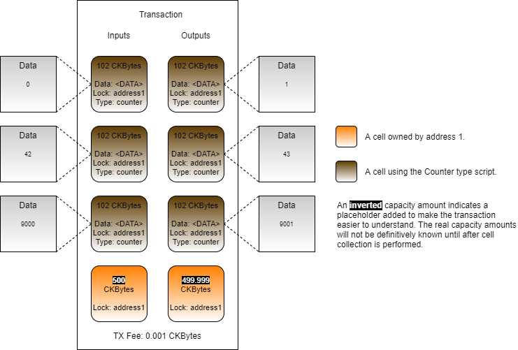

# Creating Aggregatable Scripts

One of the unique features of the Cell Model is that multiple cells can be combined into a single large transaction instead of creating separate small transactions. This process is called "aggregation". However, aggregation is only possible when scripts are programmed in a way flexible enough to allow it. In this lesson, we will demonstrate some of the basic principles of creating aggregatable scripts.  

### Minimal Concern Pattern

One of the most common ways to create an aggregatable script is the follow the minimal concern pattern.  Following this creates scripts that have composable cell logic that allows them to be combined in a single transaction safely without affecting other cells.

To incorporate the minimal concern pattern a script should:

1. Process all cells in the script group.
2. Allow any number of cells in a script group.
3. Ignore all cells that are not in the same script group.

In essence, a script should only check the minimal amount of information needed to ensure the validity of the cells it is concerned with.

### Script Logic

Next, we will show an example of an Aggregatable Counter type script. But first, we will start by reviewing the pseudo-code for the original Counter type script as a quick refresher.

```javascript
function main()
{
    group_input_count = load_input_group().length();
    group_output_count = load_output_group().length();

    if(group_input_count == 0)
        return 0;
    
    if(group_input_count != 1 || group_output_count != 1)
        return 1;

    input_value = integer_from_binary(load_input_group().get_first_cell().data);
    output_value = integer_from_binary(load_output_group().get_first_cell().data);

    if(input_value + 1 != output_value)
        return 1;

    return 0;
}
```

Now, let's take a look at how this would apply to the Counter script if the transaction contained multiple Counter cells.



This transaction would not execute successfully because the Counter type script would give an error. The offending lines in the pseudo-code would be 9 and 10. The Counter type script was only designed to process exactly one input and one output. It does not incorporate the minimal concern pattern, and it isn't composable.

Here is the pseudo-code for the Aggregatable Counter.

```javascript
function main()
{
    group_input_count = load_input_group().length();
    group_output_count = load_output_group().length();

    if(group_input_count == 0)
        return 0;
    
    if(group_input_count != group_output_count)
        return 1;

    group_input_data = load_input_group_data();

    for((i, input_data) in group_input_data.enumerate())
    {
        input_value = integer_from_binary(input_data);
        output_value = integer_from_binary(load_output_group_data(i));

        if(input_value + 1 == output_value)
            return 1;
    }

    return 0;
}
```

The code starts out the same as the regular counter. On lines 3 and 4, we count the number of group input cells and group output cells. On lines 6 and 7, we immediately succeed if there are no input cells which allows for the creation of new Counter cells.

On lines 9 and 10, we check that the counts match 1:1. This is necessary in order to match up the inputs with the outputs and locate  

