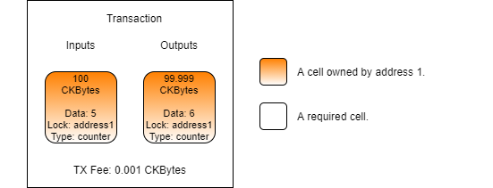

# Introduction to Scripting Part 2

### What is a Script?

We already mentioned that a script is a small program, but it is important to understand exactly what this means. In Nervos, a "script" is a very general term that indicates the code being executed to validate a transaction. This could refer to the data structure within a cell that indicates what script code should be executed or the script code binary that is executed. Often times "script" is used interchangeably with "smart contract" when speaking in a general sense.

When we talk about a script as data structure, we're talking about the structure that contains the `code_hash`, `hash_type`, and `args` fields. You've used this structure several times in the Lumos examples. This is indicating what script code should be executed during transaction validation.

When we talk about a script in terms of the script code, we're talking about a binary executable. This is a small program that is executed during transaction validation. The executable itself is Linux ELF executable that uses the RISC-V architecture. This means that if you have Linux installed on a computer with a RISC-V CPU you can execute this same binary natively without any modification. When executed on the blockchain, script code is executed in CKB-VM, a high-performance virtual machine that is emulating a RISC-V CPU.

### Script Input Data and Output Data

When a script executes, it validates the transaction, then returns an error code. Execution is always deterministic. Given the exact same transaction, execution of script code will always result in the same error code being returned. In this sense, a script is very similar to a pure function. There are never any side effects. Given the same inputs, the same output will always be generated.

When a script is executing it can read any of the details of the transaction as input data. These are things like the input cells and output cells, script args, data within cells, and witness data like signatures, all of which we will cover in later lessons.

After examining the relevant parts of the transaction, a script will generate and return an error code. This single number is the only piece of information a script can return as output data. A value of `0` indicates that execution was successful and the transaction has passed validation. Any other value indicates that there was an error during execution or that the transaction has failed validation.

A script validates transactions, which is in a sense like being asked the question "is this transaction valid?" After examining the transaction, the script must answer with either yes or no.

### Lock Scripts vs. Type Scripts

Nervos has two kinds of scripts, known as lock scripts and type scripts. Both are used to validate transactions, but their concerns different. 

The concern of a lock script is ownership. It verifies that the owner of the cell authorizes it to be used in a transaction. This is commonly done using signatures, but more advanced transactions can use other means to unlock a cell for use when special conditions are met. 

An example is the Anyone Can Pay lock script, or ACP for short. When you send CKBytes to someone, you must unlock the cell to extract the value. However, you must also unlock a cell to receive CKBytes from someone else in the same cell. The ACP lock allows this process to occur automatically when it detects that the cell value will increase rather than decrease. When taking value out of the cell, the ACP lock requires a signature to prove that they own the cell. When adding value to the cell, the ACP lock automatically unlocks and does not require a signature.

The concern of a type script is state transition. It verifies that the rules set by the developer are being followed in how state changes are allowed to occur in a transaction.

An example of type script usage is the creation of User Defined Tokens, or UDT for short. The type script includes all of the logic necessary to validate the formatting of the data inside a cell that represents a token, and the monetary policy of the token itself. 

When describing smart contract functionality, the logic must be divided between the lock script and type script. Sometimes you only need one or other and sometimes both are required. However, it's not an even split. Type scripts tend to include most of the functionality that is typically associated with a smart contract, while lock scripts are more commonly used.

Let's look at the counter transaction image again.

The lock script is assuring that only `address1` has the ability to unlock the value in this cell. They must provide a signature to unlock it. The `counter` type script is assuring that the data value is being updated by exactly 1 in each transaction. Since the current value is 5, only a value of 6 would be accepted.

Every cell requires a lock script, because every cell must have an owner. The owner could be a single person, multiple persons, or even no one, but lock script must always be present regardless. Every cell can also include a type script, but unlike the lock script, it is optional. A cell without a type script can hold CKBytes and data, but generally nothing more complex. A cell that holds an asset, such as a token, always has a type script to govern how it works.  

### Scripts as Identification

Lock scripts and type scripts are used to add functionality to cells, but they also provide a second purpose, to provide a means of identifying and locating cells.

A cell is a relatively simple structure that contains the four fields we mentioned earlier:

* Capacity
* Data
* Lock Script
* Type Script

Looking at these four fields, it might seem like there is no way of distinguishing one type of cell from another. Every cell has an out point, but that is a location in the blockchain. There are millions of cells in the blockchain, and searching through all the out points would be infeasible.

When searching for cells that exist on the blockchain, the lock script and type script are the most common way of locating cells.

The lock script validates authority. In more simplistic terms, a lock script represents a particular owner. If we search for cells with a specific lock script, we are searching for cells with a specific owner.

The type script validates state transitions. In simplistic terms, a type script defines the behavior of a cell. If we search for cells with a specific type script, we are searching for cells that all exhibit common behavior; a specific _type_ of cell.

### Script Execution **Lifecycle**

Another difference between lock scripts and type scripts is _when_ they execute.

 **Lock scripts execute on input cells. Type scripts execute on both input cells and output cells.**

A lock script is concerned with ownership, and this is the reason that a lock script must execute on inputs. Once the lock script has validated the input cell, the value which was locked in that cell is now unlocked for usage. In most cases, the lock script does not need to be concerned with how the unlocked value is used. Therefore, there is no need for lock scripts to execute on output cells.

A type script is concerned with state transition, and this is the reason that a type script must execute on both inputs and outputs. A very common use for type scripts is the creation of tokens. The type script will contain all the logic of the token, including the monetary policy. One of the most simple monetary policy requirements is that a user cannot create more tokens out of thin air. This is enforced with a single simple rule: `input_tokens >= output_tokens`. In effect, this means you cannot send more tokens than you already have.

A type script can easily enforce the logic of this rule. When a cell uses this type script, it will execute and validate the transaction to ensure token balances on both input cells and output cells are in compliance with the rule. However, it can only perform this validation if it actually executes.

In the above image, there are four simplified transactions where all cells are using a simple token type script that enforces the `input_tokens >= output_tokens` rule. We are omitting CKBytes and TX fees to make it easier to understand on a conceptual basis.

Transaction \#1 is a self-transfer. Alice is transferring 5 tokens to herself. The type script executes and checks to make sure that the rule is enforced. Alice has 5 tokens and is sending 5 tokens, so the type script would execute successfully.

Transaction \#2 is a burn operation. Bob doesn't want his tokens anymore, so he is destroying them. He provides 5 tokens to the transaction, but there are no outputs. Since the type script rule uses `>=`, this is a perfectly valid transaction and would execute successfully.

Transaction \#3 is another transfer. Alice has 5 tokens and is sending 3 to Bob, then sending 2 back to herself as change. The input and output token balances are the same, respecting the `>=` rule. This transaction is valid and would execute successfully.

Transaction \#4 is a mining operation. Charlie is attempting to create 5 tokens out of nothing. This is in violation of the token rule, and this transaction is therefore invalid and would fail.

Type scripts execute on both inputs and outputs. What if type scripts were like lock scripts, and executed on inputs but not on outputs? Transactions \#1, \#2, and \#3 would be unchanged since the token type script is still executing on inputs. However, transaction \#4 would result differently. If type scripts did not execute on outputs, then the token type script would not execute at all in transaction \#4. This would allow the transaction to succeed, allowing tokens to be created from nothing. This is why it is critical for type scripts to execute on both inputs and to properly validate a state transition.

