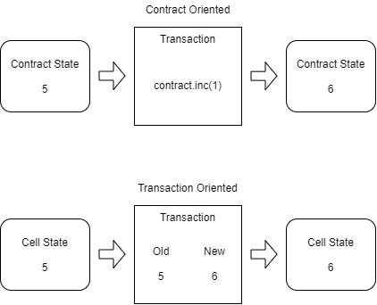

# Introduction to Scripting

Nervos allows for on-chain programmability to achieve smart contract functionality that is similar to other smart contract blockchain platforms. However, Nervos' approach is significantly different than most other platforms.

Nervos is based on the Cell Model, which we first introduced earlier. This is significantly different than the Account Model, which is used by most other platforms, including Ethererum. Both models can be used to create the same type of functionality, and build many of the same applications, but the approach that must be taken is conceptually very different.

### Account Model vs. Cell Model

Ethereum uses the Account Model, which is similar to having an account at the bank. Your account has a single number that represents your balance. You can also have balances for other tokens. Ultimately, every balance amounts to a single number that is attached to an account and every account is a representation of a user's public key or an on-chain smart contract. Every action that occurs on the blockchain can be described in a simplified way as a change to a balance on an account.

Nervos uses the Cell Model, which cannot be compared to an account at the bank. It's more like having 

\*This section is incomplete.\*

### Contract Oriented vs. Transaction Oriented

Ethereum's programming model is sometimes described as being part of a contract-oriented paradigm. The developer builds programs, known as contracts, which dictate how on-chain state changes occur. Methods on the contract are used to control state changes. An example would be the `transfer()` method of an ERC20 token contract, which would be used to send tokens from one account to another. A developer initiates a state change by creating a transaction that includes the method to call and supplies the necessary arguments to the method.

Nervos' programming model is transaction-oriented. There are no methods on a contract to call. The developer builds programs, known as scripts, which validate how an on-chain state change is allowed to occur. A developer initiates a state change by submitting a transaction that describes a valid state change.

If this seems confusing or counter-intuitive, don't be discouraged. This is a brand new way of creating smart contracts, so it may be difficult to understand at first, but it will become clear as we continue to work with it.

### Generation vs. Validation 

