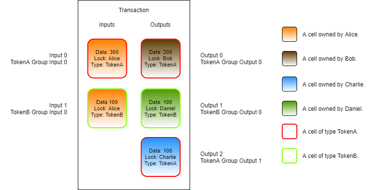
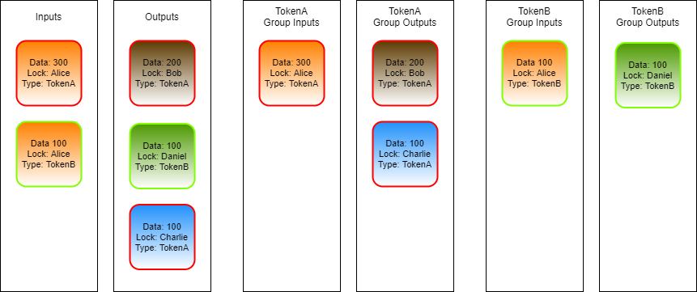

# Script Groups

In the last lesson, we learned how a type script can access and validate data in the output cells. To accomplish this we had to load our cells with `load_cell()`, then we had to check if they had the same type script before proceeding. This process works just fine, but there is a more efficient way to accomplish this same process using Script Groups.

In this example, we will use a type script that allows cells to be created only if the data field has valid JSON data. Any time a cell is created, the type script will read the data that the cell is being created with and validate it as a JSON string. Trying to create a cell containing invalid JSON will result in the transaction being rejected. We will call this the "JSON Cell" type script.

.png>)

On the top left of the image is a transaction where the JSON Cell type script is used. The data area of the cell contains a valid JSON object. If this cell were created in a transaction, meaning it was added as an output, the type script would execute without error and the transaction would process successfully.

On the bottom left is a similar transaction using the JSON Cell type script, but the data area contains a malformed JSON object. If this cell were put into a transaction as an output, the type script would execute and return an error. This transaction would be rejected.

### Script Logic in Pseudo-Code

Next, we will look at the logic and code that would be used to create this type script.

Let's take a look at it in pseudo-code first to understand the logic.


```javascript
function main()
{
    outputGroup = load_output_group();
    for cell in outputGroup
    {
        if(!is_valid_json(cell.data))
        {
            return 1;
        }
    }

    return 0;
}
```


On line 3, we load cells from the output group. This is different from the last lesson where we loaded all the output cells. The outputs could contain many different cells, but this script is only concerned with those also using the JSON Cell type script. We could check each cell, like we did in the last lesson, but this is a more simple way. The output group only the output cells that have a script that is the same as the one currently executing. We will explain more about how `GroupOutput` works momentarily.

On lines 4 to 10, we cycle through every cell in the output group, checking the data field of each one. If any of them contain invalid JSON data, an error is returned. We only check the outputs, because that is when the cell is created. When the cell is used as an input, we don't need to check again. This is because we already checked when the cell was created, and cells are immutable once created.

On line 12, we return successfully after no errors are found.

### Script Groups

We first introduced script groups back in the Introduction to Scripting Part 2. Identical scripts are put into script groups and only execute once in a transaction. These groups can be accessed as the sources `GroupInput` and `GroupOutput` for several of the syscalls such as `load_cell` and `load_cell_data`. This allows us to retrieve only the cells within an execution group.

For example, if we had a token type script that was trying to enforce the rule `input_tokens >= output_tokens`, it would need to locate all of the token cells in the transaction. There could be other cells in the transaction, but our token type script isn't concerned with those. A "token cell" is defined by a cell using the token type script, so we only need to locate those cells. The `GroupInput` and `GroupOutput` sources will only return those matching cells. Below is an image to help illustrate.



In this image, Alice is sending two types of tokens, TokenA and TokenB. This image does not include CKBytes or TX fees to help make things easier to understand.

The cells representing TokenA have a red outline. The cells representing TokenB have a green outline. In this single transaction, Alice is sending 200 of TokenA to Bob, 100 of tokenA to Charlie, and 100 of TokenB to Daniel.

TokenA and TokenB will have different type scripts, and they will both execute in this transaction. Both scripts will enforce the rule `input_tokens >= output_tokens`. When the TokenA type script executes, it is only concerned with TokenA cells. When the TokenB type script executes, it is only concerned with the TokenB cells.

Both the TokenA and TokenB type scripts could use the `Input` and `Output` sources to do this. When they execute, they will see all of the cells in the transaction. You can see this in the image as `Input 0` and `Input 1` on the left, and `Output 0`, `Output 1`, and `Output 2` on the right. Both the TokenA and TokenB type scripts will see these same cell indexes when they execute. The next step would be for each script to examine each cell, look at the type script that is used, and filter the results to only the cells of concern. This is how we did it in the last lesson, but script groups provide a more efficient way.

When the scripts use the `GroupInput` and `GroupOutput` sources, this filtration process is already available because script grouping is a part of the execution process.



When any script uses the regular `Input` and `Output` sources, they will see all the available cells. This is shown in the two left columns in the above image.

When TokenA uses `GroupInput` and `GroupOutput`, it will only see the cells of TokenA type. This is the single input cell with a red border and the two output cells with a red border. This is shown in the two middle columns of the above image.

When TokenB uses `GroupInput` and `GroupOutput`, it will only see the cells of TokenB type. These are the single input cell with a green border, and the single output cell with a green border. This is shown in the two right columns of the above image.

The use of `GroupInput` and `GroupOutput` works for type scripts as described, but it is slightly different for lock scripts. When a lock script uses `GroupInput`, the input cells with the same lock script will be returned. **When a lock script uses the `GroupOutput`, no cells will be returned.** The reason for this is that these groups are related to how scripts are being executed in CKB-VM, and lock scripts do not execute on outputs. We will describe exactly why this is later on.&#x20;

### Script Logic in Rust

Now let's look at the real version of the JSON Cell type script, written in Rust. This is located in the `entry.rs` file in `developer-training-course-script-examples/contracts/jsoncell/src`.


```rust
// Import from `core` instead of from `std` since we are in no-std mode.
use core::result::Result;
use core::str;

// Import CKB syscalls and structures.
// https://nervosnetwork.github.io/ckb-std/riscv64imac-unknown-none-elf/doc/ckb_std/index.html
use ckb_std::ckb_constants::Source;
use ckb_std::high_level::{load_cell_data, QueryIter};

// Import the lite-json library for JSON parsing/validation.
use lite_json::json_parser::parse_json;

// Import our local error codes.
use crate::error::Error;

// Main entry point.
pub fn main() -> Result<(), Error>
{
    // Load the cell data from each cell.
    for data in QueryIter::new(load_cell_data, Source::GroupOutput)
    {
        // Parse the cell data into a UTF-8 string.
        let json_str = str::from_utf8(&data).map_err(|_|Error::InvalidStringData)?;
    
        // Validate the string as JSON by parsing it.
        parse_json(json_str).map_err(|_|Error::InvalidJson)?;
    }
    
    Ok(())
}
```


Lines 1 to 14 are all imports.

* The `core` library is an alternative to the Rust standard library that has some basic structures and types that work in `no_std` mode.
* The `ckb_std` library is the standard library used for developing Nervos scripts in Rust.
* The `lite_json` library is used for JSON parsing.
* Line 14 imports the custom error codes we have created for our script.

The `lite_json` library is an unmodified third-party library that we are using in our script. Any third-party libraries can be used in scripts as long as they support `no_std` mode and can be compiled for a RISC-V target. This gives script developers access to thousands of libraries which can used without modification.

Lines 16 to 30 contain the main logic for our type script. The Rust syntax is a little more complex than our pseudo-code, but code flow is very similar, and the length of the code isn't much longer.

&#x20;On line 20, we use the `load_cell_data()` function to load cell data from the `GroupOutput` source with `QueryIter()`. Using `GroupOutput` eliminates the need to check the type script of each cell. Using script groups as sources is always preferred when possible, because it makes our code far more concise and efficient.

On line 23, we parse the raw data into a UTF-8 string, and if an error occurs during decoding we trap the error and map it to `InvalidStringData`.

On line 26, we parse the UTF-8 encoded JSON string. If the string is invalid, we trap the error and map it to `InvalidJson`.

On line 29, if no errors were detected, we return success.
