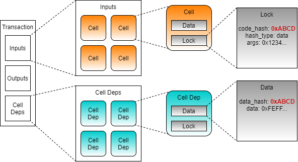
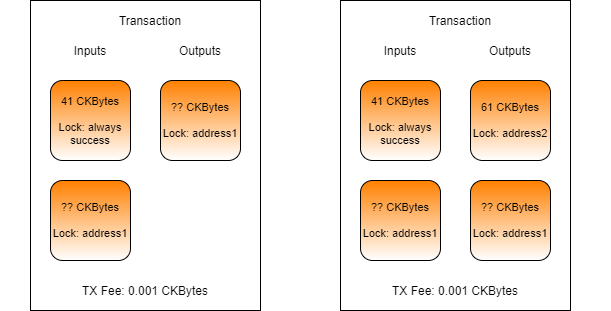

# Using Scripts

In the previous chapter, we used the `addressToScript()` function to specify the owner of a cell. As the name indicates, this function converts an address into a script. Specifically, this function generates a lock script. This is possible because an address is actually just a lock script encoded in a way to make it human-readable. Let's take a deeper look at what is being generated when we run the following code.

```javascript
let lockScript = addressToScript("ckt1qzda0cr08m85hc8jlnfp3zer7xulejywt49kt2rr0vthywaa50xwsqvc32wruaxqnk4hdj8yr4yp5u056dkhwtc94sy8q");
```

When the above code is executed, `lockScript` will be set to the following.

```javascript
{
    codeHash: '0x9bd7e06f3ecf4be0f2fcd2188b23f1b9fcc88e5d4b65a8637b17723bbda3cce8',
    hashType: 'type',
    args: '0x988a9c3e74c09dab76c8e41d481a71f4d36d772f'
}
```

The `codeHash` and `hashType` fields indicate what code should be executed. The `codeHash` value is a Blake2b hash that indicates what script code we need to execute, and `hashType` indicates how we need to treat code hash in order to match it up properly. The combination of the two together specifies **what** code should execute. If this doesn't make sense yet, don't worry. Later in this lesson, we will use it in an example that will make it perfectly clear.

The `args` value specifies the data that will be passed to the script when it executes. This is just like passing a few arguments to a command-line program. The value of the `args` field can be set to any value, and what is placed there is determined by the requirements of the script that is executing.&#x20;

In the example above, the `codeHash` and `hashType` values specify the script code for the default lock. The `args` value is Blake2b hash of the owner's public key. When the transaction is submitted to the network, the default lock's script code will be executed and passed the `args` value. Using the `args` value in combination with the other values in the transaction, the default lock can make the determination if proper credentials were provided for this cell. If proper credentials were provided, a value of `0` is returned, indicating that execution was successful. If improper credentials were provided, then an error code will be returned, indicating that execution was not successful and that the transaction is invalid.

### The Always Success Script

When any script executes, its purpose in doing so is to answer the question, "Is this transaction valid?" All scripts respond with a simple yes or no answer, in the form of an error code. A value of 0 means success and any other value means failure.

When building and testing scripts, it is very common to use a special script known as the "always success" script. This script will always give a "yes" answer when executed. &#x20;

Let's take a look at the always success script logic in pseudo-code.

```javascript
function script()
{
    return 0;
}
```

When the always success script is executed, it immediately returns with a value of 0, indicating success. There are no conditions here of any kind. This is the most simple script code that can be created.

The always success script is particularly useful for development and testing because it allows the developer to focus their scope and not have to worry about all the details that would be required in a production environment. When building a type script, it is very common for developers to specify the always success script as the lock script. This allows the developer to ignore typical lock script requirements in a transaction since they know it will always unlock the cell. This allows the developer to focus their attention on the type script.

The always success script should never be used as a lock script in a production environment. Anyone could consume the cell and immediately take the CKBytes without any permission. Since it is completely insecure, this is something we would only use for testing purposes.

### Using the Always Success Script in Lumos

Next, we will go through an example to use the always success script as a lock script in a transaction using Lumos. We're going to use a precompiled binary for this example to make things simpler. We will learn how to build and compile scripts our own scripts in a later lesson.

Open the `index.js` file from the `Using-Scripts-Example` folder. If you scroll down to the `main()` function, you will see that there four main sections.


1. Initialize - In the first three lines of code in `main()`, we initialize the Lumos configuration, start the Lumos Indexer, and initialize the lab environment.
2. Deploy Code - The `deployCode()` function creates a cell with the contents of the RISC-V binary located in the file `./files/always_success`. This is the always success lock binary executable.
3. Create Cells - The `createCells()` function creates a cell that uses the always success lock.
4. Consume Cell - The `consumeCells()` function consumes the cell with the always success lock that we just created.

### Deploying the Always Success Binary

Let's go through the `deployCode()` function. This function generates and executes and transaction that will deploy the always success binary to a cell so it can be executed on-chain in lock scripts. Some of the code at the beginning and end is redundant from previous lessons, so we will only cover the relevant code.

```javascript
// Create a cell with data from the specified file.
const {hexString: hexString1, dataSize: dataSize1} = await readFileToHexString(dataFile1);
const outputCapacity1 = ckbytesToShannons(61n) + ckbytesToShannons(dataSize1);
const output1 = {cellOutput: {capacity: intToHex(outputCapacity1), lock: addressToScript(address1), type: null}, data: hexString1};
transaction = transaction.update("outputs", (i)=>i.push(output1));
```

This code should look familiar since we've used it several times before. We're reading the always success binary into a hex string, then creating a cell with the contents.

At the end of the function you will see this code:

```javascript
// Return the out point for the always success binary so it can be used in the next transaction.
const outPoint =
{
    txHash: txid,
    index: "0x0"
};
return outPoint;
```

We're returning the out point of the cell we just created so that it can be used in the next transaction.

### Creating a Cell with the Always Success Lock

Next, let's look at the `createCells()` function. This function generates and executes a transaction that will create a cell using the always success script code as a lock script. Once again, we'll skip straight to the relevant parts.

```javascript
// Create a cell using the always success lock.
const outputCapacity1 = ckbytesToShannons(41n);
const lockScript1 =
{
	codeHash: dataFileHash1,
	hashType: "data",
	args: "0x"
};
const output1 = {cellOutput: {capacity: intToHex(outputCapacity1), lock: lockScript1, type: null}, data: "0x"};
transaction = transaction.update("outputs", (i)=>i.push(output1));
```

There are a few interesting things about this code. Look at the value of the `outputCapacity1` variable. It's set to 41 CKBytes. You may be thinking, "isn't the minimum 61?" Yes, 61 CKBytes is the minimum for a standard cell using the default lock script, but we're not using the default lock script.

The `lockScript1` variable defines the lock script for the cell. The `codeHash` is being set to a Blake2b hash of the always success lock script binary. The `hashType` is `data`, which means the `code_hash` value needs to match a Blake2b hash of the data in a cell containing the code that will be executed. Our `codeHash` value reflects this. You may have noticed that the `hashType` of the default lock script is `type`. The meaning of this value is more complicated but usually means that the script is upgradeable. We will cover that use case at a later time. Finally, we have the `args` value. Notice that it's empty. Let's compare it to the `args` of a live cell using the default lock script.


When you use the default lock script, the `args` field is always expected to have a hash of the public key. However, this specific requirement applies only to the default lock script. The `args` field can contain any data in any format. It is the script in use that dictates how the data in the `args` should be formatted, or if it is even needed at all.

The always success script code does not use `args` in any way, so it doesn't need to be included. This saves that 20 bytes of space, and is the reason our cell only needs 41 CKBytes instead of the normal 61 CKBytes.

Even though this saves a little bit of space, it isn't practical to use in a production environment. The always success lock is completely insecure, which is why we only use it for testing purposes.

The resulting generated transaction will look something like this.

.png>)

### Cell Deps

Our lock script uses the `codeHash` and `hashType` to determine **what** code should execute, but it does not specify **where** that code exists in the blockchain. This is where cell deps come into play.

We already learned about input cells and output cells in a transaction. Cell deps are the third type. Short for cell dependencies, cell deps are similar to input cells, but they are not consumed.

Since a cell dep is not consumed, it can be used repeatedly by many scripts as a read-only component of the transaction. This enables any resource specified as a cell dep to be reused repeatedly.

Some of the common uses of cells deps are:

* Script Code - Any code that executes on-chain, such as the always success lock, is referenced in a transaction using a cell dep.
* Script Libraries - Just like a library for a normal desktop application, a script library contains commonly used code for different scripts.
* State Data - A cell can contain any data, including state data for a smart contract. Data from an oracle is a good example. The data published by the oracle is read-only and can be utilized by many smart contracts that rely on it.

With the addition of cell deps, our transaction now knows **what** code is needed, and **where** the code exists, making execution possible.



When the transaction is executed, every cell in the inputs will execute its lock script. The `codeHash` identifies what code needs to execute. The code that needs to be executed will be matched against the cell dep with a matching `dataHash`. The data field of the cell from the matching cell dep contains the script code that will be executed.

This method of providing resources enables code reuse in a way that is not possible on most other blockchains. Millions of cells can exist on-chain and all rely on a single cell dep that provides the code they need. This provides massive on-chain space savings and allows for complete code reuse between smart contracts.

### Consuming a Cell with the Always Success Lock

Now let's look at the relevant parts of the `consumeCells()` function. This function generates and executes a transaction that will consume the cells we just created that use the always success lock.

```javascript
// Add the cell dep for the lock script.
transaction = addDefaultCellDeps(transaction);
const cellDep = {depType: "code", outPoint: alwaysSuccessCodeOutPoint};
transaction = transaction.update("cellDeps", (cellDeps)=>cellDeps.push(cellDep));
```

This code adds cell deps to our transaction skeleton. On line 2 you see the function `addDefaultCellDeps()`. If we look into the shared library, we will see this:

```javascript
function addDefaultCellDeps(transaction)
{
    return transaction.update("cellDeps", (cellDeps)=>cellDeps.push(locateCellDep({codeHash: DEFAULT_LOCK_HASH, hashType: "type"})));
}
```

We can see that this function is adding a cell dep for the default lock hash, and it's getting it from the `locateCellDep()` function. The `locateCellDep()` function is part of Lumos, and it can be used to locate specific well-known cell deps for the default lock script, the multisig lock script, and the Nervos DAO. This function is getting this information from the `config.json` file in the working directory.

However, we will not be able to use the `locateCellDep` function with the always success binary we just loaded, because it is not well-known. Instead, we construct a cell dep object which we add to the cell deps in the transaction using this code:

```javascript
const cellDep = {depType: "code", outPoint: alwaysSuccessCodeOutPoint};
transaction = transaction.update("cellDeps", (cellDeps)=>cellDeps.push(cellDep));
```

The `depType` can be either `code` or `depGroup`. The value of `code` indicates that the out point we specify is a code binary. The other possible value, `depGroup`, is used to specify multiple out points at once. We'll be covering how to use that in a future lesson.

If you look closely at the code in `createCells()` and `consumeCells()`, you will notice that we're only adding the always success lock as a cell dep in the consume function. The always success lock is referenced in the lock script of cells in both the create and consume functions, but we only need it to be referenced in the cell deps of the consume function is because that is the only time when it is executed.

A lock script executes when we need to check permissions to access a cell. We only need to do this when a cell is being used as an input, since this is the only time value is extracted from the cell. When creating an output, the value is coming from inputs that you have already proven you have permission to access. There is no reason you should have to prove ownership again, and therefore the lock script never executes on outputs, and we don't need to provide a cell dep to the always success binary since it isn't executing.

```javascript
// Add the always success cell to the transaction.
const input = await getLiveCell(nodeUrl, alwaysSuccessCellOutPoint);
transaction = transaction.update("inputs", (i)=>i.push(input));

// Add input capacity cells.
const capacityRequired = ckbytesToShannons(61n) + txFee;
const collectedCells = await collectCapacity(indexer, addressToScript(address1), capacityRequired);
transaction = transaction.update("inputs", (i)=>i.concat(collectedCells.inputCells));

// Determine the capacity from all input Cells.
const inputCapacity = transaction.inputs.toArray().reduce((a, c)=>a+hexToInt(c.cellOutput.capacity), 0n);
const outputCapacity = transaction.outputs.toArray().reduce((a, c)=>a+hexToInt(c.cellOutput.capacity), 0n);

// Create a change Cell for the remaining CKBytes.
const changeCapacity = intToHex(inputCapacity - outputCapacity - txFee);
let change = {cellOutput: {capacity: changeCapacity, lock: addressToScript(address1), type: null}, data: "0x"};
transaction = transaction.update("outputs", (i)=>i.push(change));
```

This code is adding our always success cell to the transaction, adding more cells for capacity, then sending everything back to ourselves as a single change cell. Remember, the always success cell we created only has 41 CKBytes in it. This is below a 61 CKByte standard cell and doesn't account for the necessary transaction fee.&#x20;

Looking at the fourth block of code for the change cell, the `lock` is set to `addressToScript(address1)`. This means it is using the default lock script again, and that 61 CKBytes is the minimum required.

The reason that `capacityRequired` in the code above is set to 61 CKBytes + the tx fee is because we are anticipating an output of a single standard cell and a tx fee.



On the left is the transaction we are generating. We are consuming the always success cell and sending the value back to ourselves, so we only need one output.

On the right is what it would look like if we were sending to someone else. We would need more capacity since we would need an output to send to them, and a change cell. In that scenario, we would need at least 122 CKBytes (+ tx fee) since we are creating two output cells. We can reuse the 41 CKBytes on the consumed always success cell, meaning the absolute minimum capacity would need to collect is 81 CKBytes (122 - 41), plus the transaction fee.

```javascript
// Sign the transaction.
const signedTx = signTransaction(transaction, privateKey1);
```

This code looks standard and we've used it many times in the past, but it's important to point out why it's necessary for this transaction. The always success lock does not require any kind of signing in order to unlock. If it was the only input cell that existed, then we could skip this step. However, we had to add additional capacity from `address1`, and those cells use the default lock, which requires a standard signature in order to unlock.
