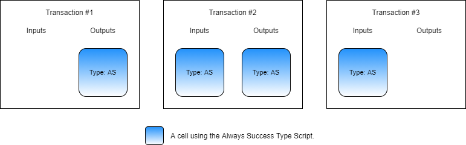
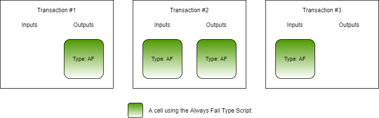

# Using Scripts

Nervos has two types of scripts, lock scripts and type scripts. We've worked with many lock scripts in the previous examples, and now we will start working with type scripts.

There are a number of similarities between lock scripts and type scripts. Both scripts have the same `code_hash`, `hash_type`, and `args` fields. Both are executing RISC-V binaries in CKB-VM. Both have access to the same details of a transaction during execution. Both play a part in answering the overshadowing question: "is this transaction valid?"

However, there are strong semantical differences between lock scripts and type scripts. Lock scripts are concerned with ownership, and type scripts are concerned with state transitions. Lock scripts define how a cell is accessed, type scripts define how a cell behaves. When used as a form of identification, lock scripts define the owner or a cell, and type scripts define what the cell is.

### Script Execution Lifecycle

Many of the details surrounding lock scripts and type scripts are the same. Based on the similarities mentioned above, it might seem like the two are interchangeable. In some cases, this is true. Both have the same three fields, `code_hash`, `hash_type`, and `args`. If you were to swap the information of these three fields between the lock script and type script on a cell, then you would be swapping the type script and lock script. The code binaries would still execute, however, there is a high likelihood that the scripts would not function as intended.

There is one major distinction between lock scripts and type scripts in regards to execution: _when_ they execute. **Lock scripts execute on input cells. Type scripts execute on both input cells and output cells.** It may not seem like that big of a difference, but this is the single factor that leads to all the semantical differences mentioned above. If lock scripts and type scripts executed at the exact same times, then the two would be completely interchangeable.

A lock script is concerned with ownership, and this is the reason that a lock script must execute on inputs. Let's look at the default lock as an example. When a cell is added as an input, it will be consumed. The value contained in the cell is being extracted for use. The default lock is verifying that the owner authorized its use in the transaction by providing a signature, allowing the cell to be unlocked. If the same lock script executed on outputs, then it would also require a signature from the recipient to complete the transaction. This is not desirable. More logic could be added to the lock script to accommodate this situation if a lock script executed on both inputs and outputs, but it is more efficient to simply not check. What is most important is that the use of the values within a cell was authorized. What is done with the value after unlock is not a consideration for the default lock.

The default lock does not take into consideration what is done with the value extracted from a cell once it is unlocked, but that doesn't mean that lock scripts are incapable of this. The Anyone Can Pay \(ACP\) lock script that we mentioned earlier is a good example of this. The ACP lock script will automatically unlock when the user is receiving additional value. To identify this, the ACP lock is examining both the inputs and the outputs of the transaction.

A type script is concerned with state transition, and this is the reason that a type script must execute on both inputs and outputs. A very common use for type scripts is the creation of tokens. The type script will contain all the logic of the token, including the monetary policy. One of the most simple monetary policy requirements is that a user cannot create more tokens out of thin air. This is enforced with a single simple rule: `input_tokens >= output_tokens`. In effect, this means you cannot send more tokens than you already have.

A type script can easily enforce the logic of this rule. When a cell uses this type script, it will execute and validate the transaction to ensure token balances on both input cells and output cells are in compliance with the rule. However, it can only perform this validation if it actually executes.


In the above image, there are four simplified transactions where all cells are using a simple token type script that enforces the `input_tokens >= output_tokens` rule. We are omitting CKBytes and TX fees to make it easier to understand on a conceptual basis.

Transaction \#1 is a basic transfer. Alice is transferring 5 tokens to herself. The type script executes and checks to make sure that the rule is enforced. Alice has 5 tokens and is sending 5 tokens, so the type script would execute successfully.

Transaction \#2 is a burn operation. Bob doesn't want his tokens anymore, so he is destroying them. He provides 5 tokens to the transaction, but there are no outputs. Since the type script rule uses `>=`, this is a perfectly valid transaction and would execute successfully.

Transaction \#3 is another transfer. Alice has 5 tokens and is sending 3 to Bob, then sending 2 back to herself as change. The input and output token balances are the same, so this transaction is valid and would execute successfully.

Transaction \#4 is a mining operation. Charlie is attempting to create 5 tokens out of nothing. This is in violation of the token rule, and this transaction is therefore invalid and would fail.

Type scripts execute on both inputs and outputs. What if type scripts were like lock scripts, and executed on inputs but not on outputs? Transactions \#1, \#2, and \#3 would be unchanged since the token type script is still executing on inputs. However, transaction \#4 would result differently. If type scripts did not execute on outputs, then the token type script would not execute at all in transaction \#4. This would allow the transaction to succeed, allowing tokens to be created from nothing. This is why it is critical for type scripts to execute on both lock scripts and type scripts.

### Always Success and Always Fail

In the last chapter, we introduced the always success \(AS\) and always fail \(AF\) scripts. These are the most simple scripts that can be created. The AS script will always execute successfully, and the AF script will always result in an error.

The AS and AF scripts are two examples of script binaries that will function identically if they are used for the lock script or the type script. However, due to the difference in _when_ execution occurs, the end results may be different.

Let's take a look at these scenarios visually. Once again, we will use simplified transaction representations that omit requirements, such as CKBytes and TX fees, to make it easier to understand on a conceptual basis. Focus only on how the lock scripts and type scripts would execute.


This image is of the AS binary being used in lock script transactions.

Transaction \#1 is a minting operation. We are creating a cell with the AS lock script.

Transaction \#2 is a transfer operation. We are transferring a cell using the AS lock script.

Transaction \#3 is a burn operation. We are destroying a cell using the AS lock script.

All three of these transactions would be successful. In transaction \#1, the AS lock script would not execute because lock scripts do not execute on outputs. In transactions \#2 and \#3, the AS lock script would execute successfully.



This image is of the AS binary being used in type script transactions. Transactions \#1, \#2, and \#3 represent minting, transfer, and burn operations respectively.

Once again, all three transactions would be successful. In transactions \#1, \#2, and \#3 the AS lock script would execute successfully.


This image is of the AF binary being used in lock script transactions. Transactions \#1, \#2, and \#3 represent minting, transfer, and burn operations respectively.

Unlike the two previous examples, not all the transactions will have the same result. In transaction \#1, the AF lock script would not execute because lock scripts do not execute on outputs. In transactions \#2 and \#3, the AF lock script would execute with an error. Only transaction \#1 would be successful because the AF lock script would not execute. However, once this cell is created it would remain locked and unchangeable forever.



This image is of the AF binary being used in type script transactions. Transactions \#1, \#2, and \#3 represent minting, transfer, and burn operations respectively.

All three transactions would fail. In transaction \#1, \#2, and \#3 the AF script binary would execute and return an error that would cause the transaction to be rejected.

### Usage in Lumos

Next, we will use the always success binary as a type script in a Lumos transaction example. We have used the always success binary as a lock script previously. Our code will deploy the binary, create some cells using the always success binary, then consume those cells that we just created to reclaim that capacity.

The code we will be covering here is located in the `index.js` file in the `Using-Type-Scripts-Example` directory. Feel free to open the `index.js` file and follow along. This code example is fully functional. You can execute this code in a console by entering the directory and executing `node index.js`.

Starting with the `main()` function, you will see our code has the usual four sections.


The initialization and deployment code is nearly identical to the previous examples, so we're not going to go over it here. Feel free to review that code on your own if you need a refresher.

### Creating the Always Success Type Script Cells

Next, let's look at the `createCellWithAlwaysSuccessTypeScript()` function. This function generates and executes a transaction that will create cells using the always success type script. We'll skip straight to the relevant parts.

```javascript
// Add the cell deps for the lock script and type script.
transaction = addDefaultCellDeps(transaction);
const cellDep = {dep_type: "code", out_point: alwaysSuccessCodeOutPoint};
transaction = transaction.update("cellDeps", (cellDeps)=>cellDeps.push(cellDep));
```

This is the code that adds cell deps to the transaction. On lines 3 and 4 the code is adding the always success binary as a cell dep. In the last chapter, we used the always success binary as a lock script, and we didn't have to add it as a cell dep while creating the cells. This is because lock scripts do not execute on outputs, so the cell dep isn't needed. Now we are using the always success binary as a type script, and type scripts execute on inputs and outputs. Therefore, we need to add it as a cell dep here.

```javascript
// Create cells using the always success type script.
const outputCapacity1 = ckbytesToShannons(94n);
const lockScript1 =
{
    code_hash: DEFAULT_LOCK_HASH,
    hash_type: "type",
    args: lockArg1
};
const typeScript1 =
{
    code_hash: dataFileHash1,
    hash_type: "data",
    args: "0x"
};
const output1 = {cell_output: {capacity: intToHex(outputCapacity1), lock: lockScript1, type: typeScript1}, data: "0x"};
transaction = transaction.update("outputs", (i)=>i.push(output1, output1, output1));
```

This is the code that generates the cells using the always success type script. There are several things interesting about this code.

On line 2, you see we are creating the cells with a capacity of 94 CKBytes. This number was picked because it is the bare minimum for this cell to be created. Most basic cells only require 61 CKBytes, because they don't use a type script. Remember, the structure of the cell itself is included in the overhead capacity requirements. A type script consists of a 32 byte code hash, a 1 byte hash type, and any args. If we look at lines 11 to 13, we see that it has a code hash, a hash type, and no args. This means our capacity requirements are `61 + 32 + 1 + 0 = 94`. When a cell uses a type script, 94 CKBytes is generally the minimum, and more may be required depending on the type script `args`. Remember, when creating a cell, the type script is optional, but the lock script is always required. It isn't possible to create a cell with only a type script, which is why the capacity requirements have a lower bound of 94 CKBytes.

On lines 3 to 8 and 9 to 14, we define the lock script and type script that will be used. We are using the default lock script and the always success type script for this cell. Notice that the structure of the scripts is exactly the same, but with different information.

On line 15, we create the cell structure. The type script is added as the value to the `type` key. If you compare it to previous examples, you will see that the `type` value was `null` when a type script was not used. 

On line 16, we add our cell structure to the outputs three times, creating three cells.

The resulting transaction will look similar to this.


### Consuming Cells Using the Always Success Type Script

Now let's look at the relevant parts of the `consumeCellWithAlwaysSuccessTypeScript()` function. This function generates and executes a transaction that will consume the cells we just created that use the always success type script.

```javascript
// Add the cell deps for the lock script and type script.
transaction = addDefaultCellDeps(transaction);
const cellDep = {dep_type: "code", out_point: alwaysSuccessCodeOutPoint};
transaction = transaction.update("cellDeps", (cellDeps)=>cellDeps.push(cellDep));
```

This code is adding the cell deps to the transaction. It is identical to the code for when we create the cells.  Both the default lock script and the always success type script will be executing here, just like before, so we need both included in the cell deps.

```javascript
// Add the always success cell to the transaction.
const lockScript1 = addressToScript(address1);
const typeScript1 =
{
    code_hash: dataFileHash1,
    hash_type: "data",
    args: "0x"
};
const query = {lock: lockScript1, type: typeScript1};
const cellCollector = new CellCollector(indexer, query);
for await (const cell of cellCollector.collect())
    transaction = transaction.update("inputs", (i)=>i.push(cell));
```

This is the code that locates the cells we just created and adds them to our transaction.

On lines 2 to 8, we are creating the lock script and type scripts that we will query for. These are exactly the same as when we created the cells.

On line 9, we create the cell collection query that includes both the lock script and type script. On lines 10 to 12, we collect all the relevant cells and add them to the transaction.

```javascript
// Add input capacity cells.
// const capacityRequired = ckbytesToShannons(61n) + txFee;
// const collectedCells = await collectCapacity(indexer, addressToScript(address1), capacityRequired);
// transaction = transaction.update("inputs", (i)=>i.concat(collectedCells.inputCells));
```

You may notice this code is still included, but it's commented out. This would add more capacity to the cell, but omitted it because we know it isn't necessary. We are consuming our always success type script cells that have 94 CKBytes of capacity each and converting them back into a single change cell that only requires 61 CKBytes of capacity. There will be more than enough capacity available for this transaction.

The resulting transaction will look similar to this.


