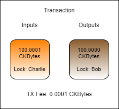
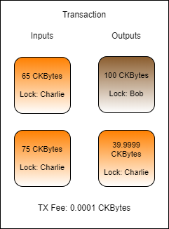
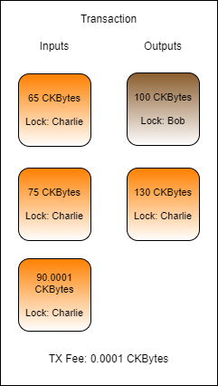

# Working with Cell Collection

One of the unique challenges with the Cell Model is how to effectively manage Cells and the capacity contained within them. The Nervos CKB blockchain contains millions of Live Cells, and a developer must be able to locate the Cells they need both for their own accounts, and for the accounts of the users they support in their dapps. 

### Indexers

An indexer is a piece of software that helps speed up the process of locating Cells and allows the developer to query for Cells based on their attributes.


An indexer runs as a background process or a separate daemon that continuously monitors a Nervos CKB node for new block data. As new blocks are found, the Cell information is extracted and organized internally by the indexer until needed. Dapp frontends and backends can then interface directly with the indexer to query for information about Cells.

Lumos has a built-in indexer as part of the framework. The allows dapps built on Lumos to perform Cell Collection very quickly, and without needing to access the CKB node directly.

```javascript
const {Indexer} = require("@ckb-lumos/indexer");
const {getLiveCell} = require("../lib/index.js");

const nodeUrl = "http://127.0.0.1:8114/";

const indexer = new Indexer(nodeUrl, "./indexer-data");
indexer.startForever();
await indexerReady(indexer);
```

This code is used to create a new instance of the Lumos indexer which will connect to a local node and store the resulting data in the directory `indexer-data`. We then start the indexer in the background using `startForever()`. This keeps the indexer running and up to date, which is beneficial for long-running dapp backend servers. If you have a small program that is designed to run once and exit, then consider using `start()`. Lastly, we wait for the indexer to synchronize with the node using our library function `indexerReady`.

### Automated Cell Collection

Up until this point we have been manually doing Cell collection through `ckb-cli` or by using the outputs of transactions we just recently created. Of course, this is not an effective way of doing this in a real dapp. Cell collection needs to be done quickly and automatically.

Lumos has a class called `CellCollector` which is designed to help with Cell collection, but it requires some additional code to be used for our purposes. Here is the `collectCapacity` function that exists in the main shared library of the Developer Training Course repo `lib/index.js`.

```javascript
async function collectCapacity(indexer, lockScript, capacityRequired)
{
	const query = {lock: lockScript, type: null};
	const cellCollector = new CellCollector(indexer, query);

	let inputCells = [];
	let inputCapacity = 0n;

	for await (const cell of cellCollector.collect())
	{
		inputCells.push(cell);
		inputCapacity += BigInt(cell.cell_output.capacity);

		if(inputCapacity >= capacityRequired)
			break;
	}

	if(inputCapacity < capacityRequired)
		throw new Error("Unable to collect enough cells to fulfill the capacity requirements.");

	return {inputCells, inputCapacity};
}
```

This function is used to collect Cells for use as capacity in a transaction. It uses a `CellCollector` instance to query the indexer to find Live Cells.

Looking at line 1, it takes the following arguments:

* `indexer` is an instance of the Lumos indexer that is initialized and fully synced with a Nervos CKB node.
* `lockScript` is something we will cover in one of the next topics. For now, think of it as the owner of a Cell.
* `capacityRequired` is the amount of CKBytes, in Shannons, that are needed to complete our transaction.

Looking at line 3 we see this:

```javascript
const query = {lock: lockScript, type: null};
```

This JSON object is describing attributes of Cells that we want to locate. In this case, they are Cells which are owned by the specified `lockScript` and do not have a Type Script.

The rest of the code should be fairly easy to understand. It continuously gathers Live Cells that match the query until we have the required capacity, or it errors if there are not enough Cells to meet the requirement.

### Capacity Management

Let's say that Charlie wants to send Bob 100 CKBytes. If Charlie had a Cell that contained exactly enough CKBytes, this would be a very straight forward transaction.



In this transaction, Charlie uses a Cell that has exactly 100.0001 CKBytes. Exactly 100 CKBytes is sent to Bob, and the remaining 0.0001 CKBytes is used at the transaction fee. It is very unlikely that this scenario would occur in reality, since the exact amounts present in Cell are very unlikely to match the exact amounts needed for the transaction.



Here is a slightly more realistic transaction example. Cell collection was performed to gather at least 100.0001 CKBytes to send to Bob and pay transaction fees. Two Cells were found for 65 CKBytes and 75 CKBytes, for a total of 140 CKBytes.  Now there is enough capacity to pay Bob 100 CKBytes, pay a 0.0001 CKByte transaction fee, and the remaining 39.9999 CKBytes can be sent back to Charlie as change.

However, this transaction has a problem and would be invalid. Can you spot the problem?

The problem with this transaction is that the Change Cell has 39.9999 CKBytes, but as we covered earlier, the minimum capacity of a Cell is 61 CKBytes. This is because a Cell must have enough capacity to cover its own overhead for data storage, which is 61 bytes for a basic Cell.

To solve this, another round of Cell collection must occur to gather enough capacity to properly structure this transaction.



Cell collection continues, and a third Input Cell is found with 90.0001 CKBytes. Now there is enough input capacity to create the Change Cell and this transaction would be successful.

