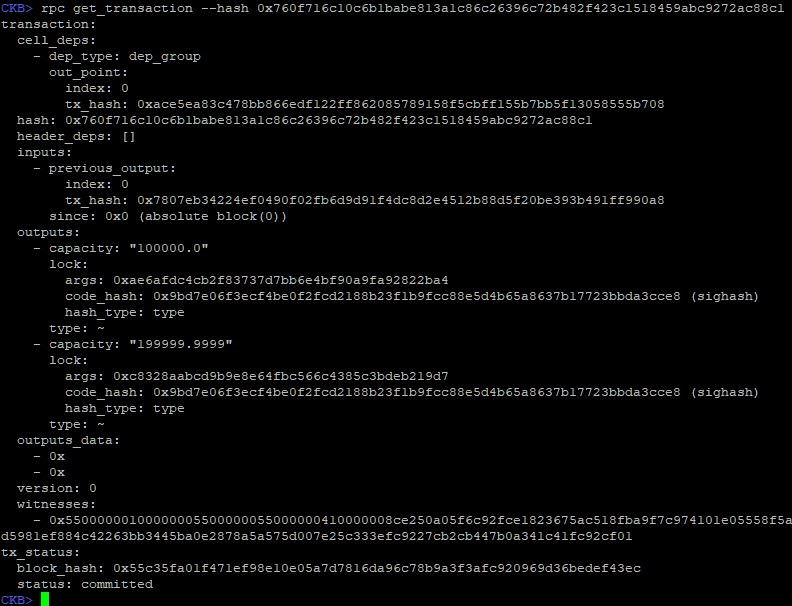
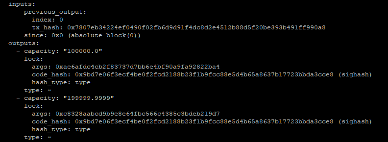
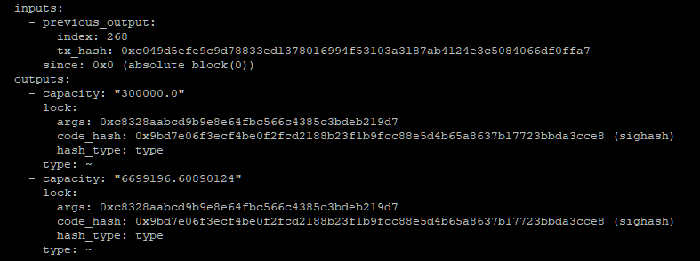
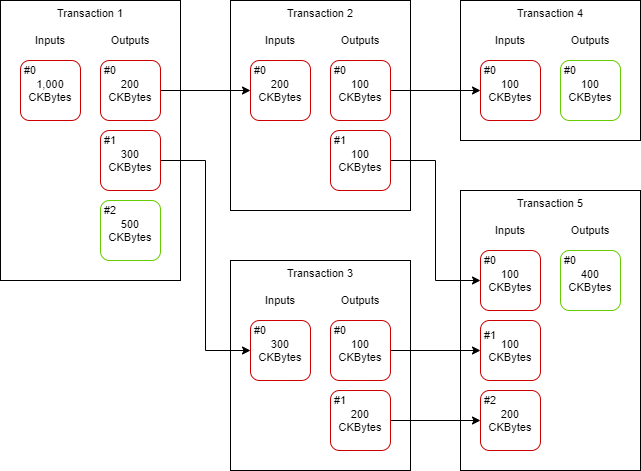
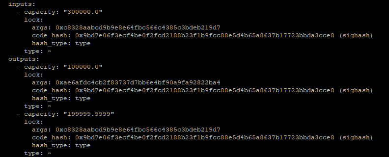

# Examining a Transaction

Let's examine the transaction that was created in the last lab exercise using `ckb-cli`. You will need the transaction ID that was generated from the last lab exercise, so make sure it's handy.

### Retrieving Transaction Details

To get the details of a transaction you use the `rpc get_transaction` command in `ckb-cli`. In the command below, replace `<TRANSACTION_ID>` with the transaction id you generated in the last lab exercise.

```text
rpc get_transaction --hash <TRANSACTION_ID>
```



Your output should look similar to the above, but some of your hashes will be different.

The two sections we will focus on are the inputs and outputs. All the other sections can be ignored for the time being. If it seems confusing as we're going through it, don't be intimidated. By the end of this lesson, it should be much more clear.

### Inputs and Outputs

In the previous lab exercise, you were asked to send 100,000 CKBytes between two accounts. Looking closer that the outputs, you should see something familiar.



One of the outputs has 100,000 capacity. Remember, capacity is another way of describing the CKBytes. This is the 100,000 CKBytes that was transferred from the sending account to the receiving account.

Below that you see another output with 199,999.9999 capacity. This is the change of the transaction. Think of it like paying for a $5 item with a $20 bill. You would hand your $20 to the cashier, and they would hand you $15 back as change. This is the same basic process but in a purely digital system, our bills are often not in the same denomination.

These CKBytes had to have been transferred from somewhere, and that place is the inputs. 



There is one input and it has a `previous_output` with a `tx_hash` and `index` as a reference. If we use `ckb-cli` to look up that transaction hash and look at the matching index, we see an output with 300,000 capacity.

Every input is an output from a previous transaction, and that's why it's called a "previous output" in `ckb-cli`. A transaction can have many outputs, which is why the index is specified in addition to the tx\_hash. The combination of a `tx_hash` and an `index` is called an "out point", and it is used to describe where an output originates from.

Below is a diagram that shows how inputs and outputs are related, and how CKBytes can move around between transactions. Note: TX fees are omitted to keep it more simple.



* TX1 has an input of 1,000 CKBytes, which is split into three outputs of 200, 300, and 500.
* TX2 is using an output from TX1, and has two outputs of 100 and 100.
* TX3 is using an output from TX1, and has two outputs of 100 and 200.
* TX4 is using an output from TX2, and has a single output of 100.
* TX5 is using multiple outputs from TX2 and TX3, and has a single output of 400.

An output can only be used once as an input. After that, it is marked as "spent" and cannot be used again. This is how the protocol ensures that the same CKBytes cannot be spent in two places. The inputs and outputs have been colored to indicate which have been spent \(red\), and which are still unspent \(green\).

An unspent transaction output is more commonly known as a UTXO, and this is the foundation of the UTXO model that Bitcoin is built on. If you want to read more on UXTO, you can optionally do so [here](https://www.mycryptopedia.com/bitcoin-utxo-unspent-transaction-output-set-explained/). Nervos' model is inspired by Bitcoin's UTXO model, so you will find that many of the concepts and terminology is used interchangeably.



The formatting on the inputs and outputs is different, so it's hard to compare. The image below combines the two screenshot images from earlier so the formatting on the inputs matches the outputs. This will make it easier to compare the capacity values to understand what's going on.

With this combined image, the amounts should start to make more sense. The inputs have a total of 300,000 CKBytes. The outputs have one for 100,000 CKBytes, and one for 199,999.9999 CKBytes, for a total of 299,999.9999 CKBytes.

There is a difference of 0.0001 CKBytes. This difference is the transaction fee that we specified when sending the transaction. Whenever there is an unaccounted difference in CKBytes between the inputs and outputs, that is the fee paid to miners for processing the transaction. You can think of this like leaving a tip on the table at a restaurant after you've paid what was listed on the bill.

With the transaction fee taken into account, the CKBytes are now 100% accounted for.

* The sender started with 300,000 CKBytes.
* The sender sent 100,000 CKBytes to the receiver.
* The sender sent 199,999.9999 CKBytes back to themselves as change.
* The sender paid a 0.0001 CKByte transaction fee to the miners.

