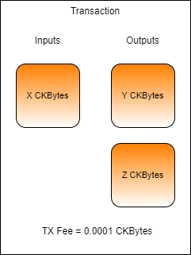

# Lab: Calculating Capacity Requirements

Complete the transaction in `index.js` found in the folder `Lab-Calculating-Capacity-Requirements-Exercise` by adding code and values as necessary. 

1. Perform a manual Cell collection and locate a usable Live Cell owned by the account `ckt1qyqvsv5240xeh85wvnau2eky8pwrhh4jr8ts8vyj37` and use it to populate the `previousOutput` variable.
   * Hint: The last successful transaction we worked on earlier in this lesson will give you a usable out point matching this account. You should already have the TX hash.
2.  Populate the `txFee` variable with a 0.0001 CKByte fee.
   * Hint: The fee value must be given as a BigInt value expressed in Shannons. There are 100,000,000 Shannons in a CKByte.
3. Populate the `output2` variable with a Cell output structure that properly creates a change Cell for any remaining CKBytes from the Input Cell.
   * Hint: Pay attention to the value of `output1` for the syntax of the value.
4. The transaction you create should have one input, two outputs, and a TX fee.

Run your code by opening a terminal to the `Lab-Calculating-Capacity-Requirements-Exercise` folder and running `node index.js`. If you get stuck you can find the solution in the `Lab-Calculating-Capacity-Requirements-Solution` folder, but don't use it unless you absolutely need it!

Once your code successfully executes, the resulting transaction id will be printed on the screen. Record this value so it's available in the future.

