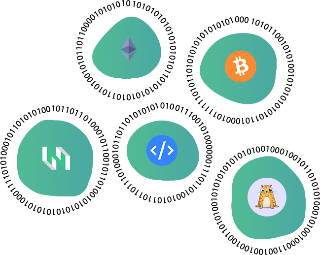
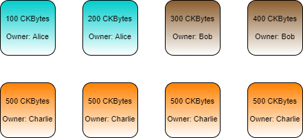
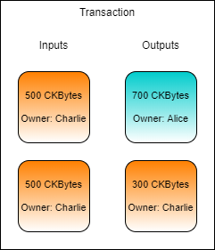
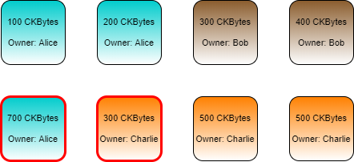

# The Cell Model

### Lesson Introduction

In this lesson, we will introduce Nervos' Cell Model, and use it to generate a transaction using code. You will need the out points you verified from the last lab exercise, so make sure you have them handy.

### The Cell Model

In the last lab exercise, you may have noticed that the command you used to verify that your outputs is called `get_live_cell`. It's called this because, in Nervos' terminology, both inputs and outputs are canonically referred to as "Cells".

A Cell is the most basic structure needed to represent a single piece of state data. The design is inspired by Bitcoin's outputs, but Cells have more flexible functionality. Cells can be used to represent any kind of on-chain asset type on Nervos, such as tokens, NFTs, and wrapped assets.

Below are the terms used for the Nervos Cell Model. We will stick to the Nervos terminology going forward, but know that it is not uncommon for others to use Bitcoin terminology when speaking about Nervos.

| Bitcoin | Nervos Cell Model |
| :--- | :--- |
| Input | Input Cell |
| Output | Output Cell |
| Unspent Output | Live Cell |
| Spent Output | Dead Cell |
| Spend | Consume  |

A Cell can only be used as an input to a transaction a single time, just like we covered in the last lesson. A Live Cell is one that has not been used as an Input Cell and is available to be used. A Dead Cell is one that has already been consumed by using it as an Input Cell and is no longer available for use.

Every Cell has an owner, and an individual can own any number of Cells. In the illustration below, Alice, Bob, and Charlie each own several Cells with different balances.

* Alice has two Cells for a total of 300 CKBytes.
* Bob has two Cells for a total of 700 CKBytes.
* Charlie has four Cells for a total of 2,000 CKBytes.

Let's say that Charlie wants to send 700 CKBytes to Alice. To create a transaction, the relevant Live Cells must be gathered for use as inputs in a process called Cell collection. Charlie has four Cells available that could be used, but none of them have enough to send Alice 700 CKBytes, so we will need to use multiple Cells.

During Cell collection we need at least 700 CKBytes to pay Alice, so we gather two Cells to cover that amount. Our total Input Cells contain 1,000 CKBytes, but Charlie only wants to send 700 CKBytes to Alice. This means Charlie needs to send 300 CKBytes back to himself as change.

After the transaction has confirmed, the Cells which were used as inputs will be consumed, and two new Cells will be created. The new Cells created in the transaction are outlined in red below. 

