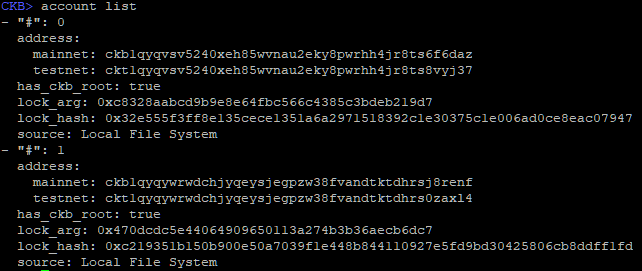

# Sending a Basic Transaction

### Lesson Introduction

In this lesson, we will send a basic transaction using the `ckb-cli` command line tool. You will need to be running a CKB Dev Blockchain in order to complete this lesson. A node configured for the Testnet or Mainnet will not work properly. If you haven't already set one up, go back to the [Lab Exercise Setup](https://nervos.gitbook.io/developer-training-course/lab-exercise-setup) section and make sure you have completed everything required.

### Verifying Your Accounts

Launch `ckb-cli` in your console. You should be presented with a screen similar to this.


Note: In my examples, I have disabled colored output to make it easier to read on a black terminal background. If you have difficulty with colors on your screen, use the command `config --color` to toggle them on and off.

To list the accounts you have in `ckb-cli`, use the command `account list`. If you followed the Lab Exercise Setup instructions completely, you should see the same two accounts on your screen.



These are two special accounts that are used only on dev blockchains. When the dev blockchain is created, these accounts are issued a very large amount of CKBytes, the native token of Nervos. Our examples will use these accounts often since they have plenty of CKBytes.

On the screen, you may see some terminology that isn't familiar. We will cover everything eventually, but for now, we're only going to cover testnet address.

#### Testnet Address

An address on Nervos CKB is similar to other blockchains. It indicates a source or destination for a transaction. The address itself is a special encoded value that specifies both an identity and how it should be accessed, and also includes a checksum value so it cannot be typed incorrectly.

A testnet address can only be used on a testnet. Trying to use a testnet address on the mainnet will always fail. This prevents mistakes from being made when moving between a testnet and mainnet.

### Transferring CKBytes

To send CKBytes from one account to another we will use the `wallet transfer` command. Copy and paste the following command to send 1000 CKBytes between the two accounts: 

```text
wallet transfer --from-account ckt1qyqvsv5240xeh85wvnau2eky8pwrhh4jr8ts8vyj37 --to-address ckt1qyqywrwdchjyqeysjegpzw38fvandtktdhrs0zaxl4 --capacity 1000 --tx-fee 0.0001
```

You will be prompted to enter a password. This is the password you selected when you first imported the accounts during the Lab Exercise Setup.


Let's break down the parameters one at a time.

* `--from-account` This specifies the account to send CKBytes from.
* `--to-address` This specifies the account to send CKBytes to.
* `--capacity` This is the amount of CKBytes we are sending. We will explain why it's called capacity later on. For now, just think of it as a synonym for CKBytes.
* `--tx-fee` This is the number of CKBytes to include as a transaction fee to pay miners. 

Once submitted, you will be presented with a long hex value. This is the transaction id, and your value will be different than ours.

### Lab Exercise

Task: Create a third account, and send it 100,000 CKBytes in a single transaction.

1. First, you will need to create a third account. Use the command `account new` to do this.
2. After the account is created, use the command `wallet transfer` to send CKBytes from one of your existing accounts to the new account.

If you need help with either command, use the `--help` switch to display help.

Once submitted, your transaction id will be printed on the screen. We will use this in the next section, so be sure to copy this value somewhere that it can be retrieved later.  

