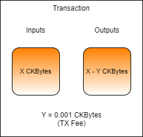

# Introduction to Lumos

Lumos is a dapp framework. It is used for backend dapp development and is very useful for creating transactions and interacting with the blockchain.

Open the `index.js` file from the `Introduction-to-Lumos-Example` folder in the Developer Training Course repo you cloned from GitHub. If you don't have this, go back to the Lab Exercise Setup section for instructions on how to clone it from GitHub.

This code in `index.js` will generate a basic transaction with one input and one output. We will be generating a real transaction on your CKB Dev Blockchain, but the code you see here is simplified to make it easier to follow.

The input cell that the code uses will be specified by one of two out points you verified in the last lab exercise. The output that is created is a change cell that returns the CKBytes back to the same account, minus the transaction fee. 



Starting at the top of the file, we have the includes.

```javascript
const {initializeConfig} = require("@ckb-lumos/config-manager");
const {addressToScript, TransactionSkeleton} = require("@ckb-lumos/helpers");
const {addDefaultCellDeps, addDefaultWitnessPlaceholders, getLiveCell, initializeLumosIndexer, sendTransaction, signTransaction, waitForNextBlock, waitForTransactionConfirmation} = require("../lib/index.js");
const {hexToInt, intToHex} = require("../lib/util.js");
const {describeTransaction, initializeLab} = require("./lab.js");
```

We have a few includes from Lumos framework, but most are from our shared library, utility library, and lab library. The shared library contains some functions to handle common operations. The utility library contains some basic converters and formatters. The lab library is used to set up and validate lab environments and make concepts easier to understand.

Next, you will see a group of variables, which we will explain.

```javascript
const nodeUrl = "http://127.0.0.1:8114/";
const privateKey = "0xd00c06bfd800d27397002dca6fb0993d5ba6399b4238b2f29ee9deb97593d2bc";
const address = "ckt1qyqvsv5240xeh85wvnau2eky8pwrhh4jr8ts8vyj37";
const previousOutput =
{
	tx_hash: "0x0000000000000000000000000000000000000000000000000000000000000000",
	index: "0x0"
};
const txFee = 100_000n;
```

* The `nodeUrl` variable is set to the URL of the CKB Dev Blockchain you set up in the Lab Exercise Setup section.
* The `privateKey` variable is set to the key used to sign transactions. This is the private key for the account `ckt1qyqvsv5240xeh85wvnau2eky8pwrhh4jr8ts8vyj37` which contains some genesis issued CKBytes. You may recognize this address from when you executed `account list` in `ckb-cli`.
* The `address` variable is set to the CKB address of the account being signed, and is set to the same account as the `privateKey`.
*  The `previousOutput` variable will be set to the out point of a live cell to be used in this transaction. 
* The `txFee` variable is the amount of transaction fee to pay, in a measurement unit called "Shannons". There are 100,000,000 Shannons in a CKByte, just like there are 100,000,000 Satoshis in a Bitcoin.

We'll walk through each line of code to give a deeper explanation of what is happening.

```javascript
// Initialize the Lumos configuration which is held in config.json.
initializeConfig();
```

Lumos must be initialized with a configuration file before it can be used for the first time. This configuration file is named `config.json`, and it is normally found in the current directory where your script executes from. This is already set up for you in the developer training course repo.

```javascript
// Start the Lumos Indexer and wait until it is fully synchronized.
const indexer = await initializeLumosIndexer(nodeUrl);
```

Next, we initialize the Lumos Indexer. The Indexer is a tool that is used to locate cells quickly. We will be covering the Indexer in more depth later. The library function `initializeLumosIndexer()` is a facade that simplifies the code to improve readability. In the next topic, we will look at what this is doing under the hood.

```javascript
// Create a transaction skeleton.
let transaction = TransactionSkeleton({cellProvider: indexer});
```

This creates a Lumos transaction skeleton. This is an empty transaction structure which we will populate with information, like what cells to consume as inputs, and which to create as outputs. We will then use this transaction skeleton to generate a real transaction that is sent to the CKB node via RPC, and broadcast to the network.

```javascript
// Add the cell dep for the lock script.
transaction = addDefaultCellDeps(transaction);
```

This adds in the required cell deps. Cell deps is short for cell dependencies, and we will cover exactly what this is in a later lesson. For now, think of them as libraries needed for the transaction to complete.

```javascript
// Initialize our lab.
await initializeLab(nodeUrl, indexer);
```

This initializes the lab environment by setting up on-chain resources in a way so it is ready for the lab exercise. We do this to create a predictable environment so you can focus specifically on the relevant code and less on the setup and teardown of a lab exercise.

```javascript
// Add the input cell to the transaction.
const input = await getLiveCell(nodeUrl, previousOutput);
transaction = transaction.update("inputs", (i)=>i.push(input));
```

This creates an input from a live cell using the out point you specified in the `previousOutput` variable, then adds it to the transaction.

The transaction skeleton is built with the [ImmutableJS](https://immutable-js.github.io/immutable-js/) library, which is why it uses the `update()` syntax. Check out their documentation if you need more information on the syntax and usage.

```javascript
// Add an output cell.
const outputCapacity = intToHex(hexToInt(input.cell_output.capacity) - txFee);
const output = {cell_output: {capacity: outputCapacity, lock: addressToScript(address), type: null}, data: "0x"};
transaction = transaction.update("outputs", (i)=>i.push(output));
```

This creates an output for a change cell with the same capacity as the input, minus the TX fee. The `lock` defines who the owner of this newly created cell will be, and that is defined with the `address` variable. We will explain `type` and `data` in a later lesson.

The `addressToScript()` function in Lumos converts an address to a script data structure, which is the form required by Lumos. An address is actually just an encoded and shortened version of a script, so the two can be converted back and forth easily. We will learn more about addresses and scripts in a later lesson. 

```javascript
// Add in the witness placeholders.
transaction = addDefaultWitnessPlaceholders(transaction);
```

The Witness is the part of the transaction that holds all the data provided with a transaction to prove its validity. This includes signatures that prove the owner of the input cells authorized their usage in the transaction. The structure of Witness requires specific formatting, which we will cover in a later lesson.

The `addDefaultWitnessPlaceholders()` shared library function creates this structure for us and adds in the required placeholders for the most common basic usage scenario.

```javascript
// Print the details of the transaction to the console.
describeTransaction(transaction.toJS());
```

This prints the current transaction to the screen in an easy to read format. The `describeTransaction()` function is part of the shared library and is provided as an easier-to-read alternative to the normal viewing of transactions as JS objects, which may include all kinds of extra information that isn't relevant right now. 

```javascript
// Validate the transaction against the lab requirements.
await validateLab(transaction);
```

The `validateLab()` function verifies that the transaction meets the requirements of the lab. Similar to the `initializeLab()` function, this is something we use on lab exercises, but it would never be used in a production environment.

```javascript
// Sign the transaction.
const signedTx = signTransaction(transaction, privateKey);
```

This signs the transaction using the private key specified in the `privateKey` variable using the Secp256k1 algorithm. Signing the transaction authorizes the usage of any input cells that are owned by that private key. The `signTransaction()` shared library function is another facade used to simplify readability.

```javascript
// Send the transaction to the RPC node.
const result = await sendTransaction(nodeUrl, signedTx);
console.log("Transaction Sent:", result);
```

This sends the signed transaction to the local CKB Dev Blockchain node and prints the resulting TX hash to the screen. If you watch your CKB node output in another terminal window you should see it confirm shortly after submission.

```javascript
// Wait for the transaction to confirm.
await waitForTransactionConfirmation(nodeUrl, txid);
console.log("\n");
```

This waits for the transaction we just sent to confirm before we continue. The `waitForTransactionConfirmation()` shared library function that uses the CKB node RPC to continuously check the status of a transaction, waiting for it to confirm before proceeding.

Now scroll back up to the top. We need to change the `previousOutpoint` value to match one of the out points you verified at the end of the last lesson. You should have verified two out points. The out point you want is the one that is owned by the address `ckt1qyqvsv5240xeh85wvnau2eky8pwrhh4jr8ts8vyj37` since that is the private key we are using. Hint: The `lock_arg` which you recorded can be used to match it with the address. Use the `ckb-cli` command `account list` to find out the `lock_arg` for the matching testnet address. We will cover the purpose of what a `lock_arg` is in the next lesson.

```javascript
const previousOutput =
{
	tx_hash: "0x0000000000000000000000000000000000000000000000000000000000000000",
	index: "0x0"
};
```

After you have updated the code with the proper out point, open up a terminal and execute the command `node index.js` from within the code directory to run the code. Your output should be similar to that below. Record the TX hash since we will use it again later.

```javascript
$ node index.js

Inputs:
  - capacity: 1,713,808,107,881,380 Shannons
    lock: 0x32e555f3ff8e135cece1351a6a2971518392c1e30375c1e006ad0ce8eac07947
    type: null
    out_point: 0x0017950609aa557433a117eab807361fe3e21794f08fd29fa201fb005928bb3e-0x0
Outputs:
  - capacity: 1,713,808,107,781,380 Shannons
    lock: 0x32e555f3ff8e135cece1351a6a2971518392c1e30375c1e006ad0ce8eac07947
    type: null

Transaction Sent: 0xbdf6c1cbf69e97234aae29b6db4a1df107240cb478ff290c214d403b1dfbd94d
```

Within a few seconds, your transaction should confirm. You can use the `ckb-cli` command below to check the status of the transaction. The transaction is confirmed once the status at the bottom of the output reads `status: committed`.

```text
rpc get_transaction --hash <TX_HASH>
```

Go back to the terminal where you ran the code, and try executing the code again. Can you guess what will happen before running it? Run the code again using the same command as before: `node index.js`.

You should get the following error:

```text
UnhandledPromiseRejectionWarning: Error: Live cell not found at out point: 0x3a52afb04b91097c84ca287ce58f98c1a454a3aa53497fbdd0ad6cba4b66f43b-0x0
```

The reason we received this error is that the out point we specified in the code has already been used. Using a live cell as an input will consume it and transform it into a dead cell. This can only occur a single time, which is why we received that error when trying to use it again.

