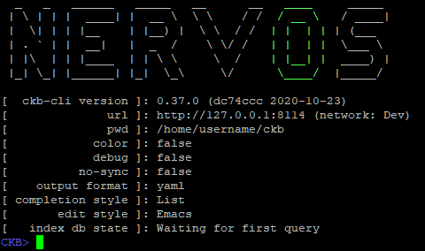

# Sending a Basic Transaction

We will begin by sending a basic transaction using the `ckb-cli` command-line tool. You will need to be running a CKB Dev Blockchain in order to complete this lesson. A node configured for the Testnet or Mainnet will not work properly. If you haven't already set one up, go back to the [Lab Exercise Setup](https://nervos.gitbook.io/developer-training-course/lab-exercise-setup) section and make sure you have completed the setup as directed.

### Verifying Your Accounts



Launch `ckb-cli` in your console. You should be presented with a screen similar to this.

Note: In my examples, I have disabled colored output to make it easier to read on a black terminal background. If you have difficulty with colors on your screen, use the command `config --color` to toggle them on and off.

Use the command `account list` to show the accounts that are being managed by `ckb-cli`.&#x20;

.png>)

If you followed the Lab Exercise Setup instructions completely, you should see the same two accounts on your screen. These are two special accounts that are used only on dev blockchains. When the dev blockchain is created, these accounts are issued a very large amount of CKBytes, the native token of Nervos. Our examples will use these accounts often since they have plenty of CKBytes.

On the screen, you may see some terminology that isn't familiar. We will cover everything eventually, but for now, we're only going to cover addresses.

#### Addresses

An address on Nervos CKB is similar to other blockchains. It indicates a source or destination within a transaction. The address itself is a special encoded value that specifies both an identity and how it should be accessed and also includes a checksum value so it cannot be typed incorrectly.

Different addresses exist for use on the mainnet or on testnets. Each address can only be used on their respective network. Trying to use a testnet address on the mainnet will always fail. This prevents mistakes from being made when moving between a testnet and mainnet.

If you look closely at the output, you should see testnet address `ckt1qzda0cr08m85hc8jlnfp3zer7xulejywt49kt2rr0vthywaa50xwsqwgx292hnvmn68xf779vmzrshpmm6epn4c0cgwga`. We are working with a devnet, which is a kind of testnet, so this the address we will be using. To keep things readable more readable, going forward we will abbreviate addresses using the first four and last four letters. ie: `ckt1...gwga`

### Transferring CKBytes

To send CKBytes from one account to another we will use the `wallet transfer` command. Copy and paste the following command to send 1000 CKBytes between the two accounts:&#x20;


```shell
wallet transfer --from-account ckt1qzda0cr08m85hc8jlnfp3zer7xulejywt49kt2rr0vthywaa50xwsqwgx292hnvmn68xf779vmzrshpmm6epn4c0cgwga --to-address ckt1qzda0cr08m85hc8jlnfp3zer7xulejywt49kt2rr0vthywaa50xwsq28phxutezqvjgfv5q38gn5kwek4m9km3cmajeqs --capacity 1000
```


.png>)

You will be prompted to enter a password. This is the password you selected when you first imported the accounts during the Lab Exercise Setup.

Let's break down the parameters one at a time.

* `--from-account` This specifies the account to send CKBytes from.
* `--to-address` This specifies the account to send CKBytes to.
* `--capacity` This is the amount of CKBytes we are sending. We will explain why it's called capacity later on. For now, just think of it as a synonym for CKBytes.

Once submitted, you will be presented with a long hex value. This is the transaction ID, also known as the transaction hash. Your value will be different than in our screenshot.
