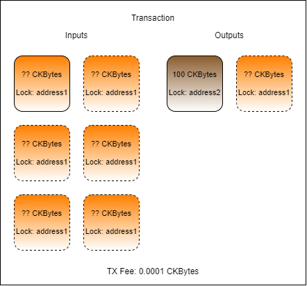

# Lab: Implement Automated Cell Collection

Complete the transaction in `index.js` found in the folder `Lab-Implement-Automated-Cell-Collection-Exercise` by adding code and values as necessary.

The transaction you create should have one or more inputs from `address1`, one output to `address2` for 100 CKBytes, one change cell back to `address1`if necessary, and a TX fee.

1. Populate the `txFee` variable with a 0.001 CKByte fee.
   * Hint: The fee value must be given as a BigInt value expressed in Shannons. There are 100,000,000 Shannons in a CKByte.
2. Populate the `outputCapacity1` variable with exactly 100 CKBytes. This will be sent from `address1` to `address2`.
   * Hint: Capacity values added to the cell output structure must be in Shannons, and expressed as a hex value. Don't forget to use `intToHex()` and `ckbytesToShannons()`.
3. Populate the `capacityRequired` variable with the amount of capacity required for the transaction.
   * Hint: The amount of capacity required will be the amount of capacity in `outputCapacity1` but a change cell is also needed.
4. Populate the `{inputCells}` variable with cells automatically collected using the `collectCapacity()` function.
   * Hint: Look at the shared library file `lib/index.js` if you need to see the syntax for usage.
5. Populate the `outputCapacity2` variable with the amount of change needed.
   * Hint: This should properly account for the `inputCapacity`, the `outputCapacity`, and the `txFee`.
6. Populate the `output2` variable with the JSON structure for an output cell to use as change back to `address1`.
   * Hint: You can copy the structure from `output1` to use as a reference. 

Run your code by opening a terminal to the `Lab-Implement-Automated-Cell-Collection-Exercise` folder and running `node index.js`. If you get stuck you can find the solution in the `Lab-Implement-Automated-Cell-Collection-Solution` folder.

Once your code successfully executes, the resulting transaction ID will be printed on the screen.

