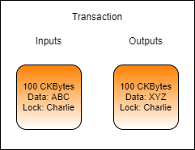

# Updating Data in a Cell

Updating the data in a cell is another common process that must be performed, but it's not quite as intuitive as one might think. Cells are immutable structures. Once they are added to the blockchain they cannot be modified in any way. The process to update the data of a cell is to consume an existing cell and then create a new one in its place.



In the above example image, Charlie is updating the data in a cell he owns. The input cell is consumed and effectively destroyed. In its place, a new cell is created with different data. Note: The transaction fee has been omitted from this example for simplicity.

In a sense, it isn't really an "update" at all because the cell being consumed has no direct connection to the cell being created. The process should be relatively simple at this point, but it is important to completely understand what is going on. Once we start working with smart contracts in later lessons, it will become apparent why this conceptual difference is very important.

### Updating Data Using Lumos

Updating a cell in Lumos consists of first locating the existing cell to be updated, and then constructing the new cell to replace it. If we already know the out point of the cell we want to update then we can specify it directly, but for this example, we will rely on cell collection since it is a more common scenario.

To locate the existing cell, we will use the `CellCollector()` as we did previously, but we will need to update the query to only return cells that have the specific data we're looking for.

Here is the query that is used with the `CellCollector()` in the shared library function `collectCapacity()`:

```javascript
{lock: lockScript, type: null}
```

This is a simple query that searches for live cells that have a specific lock script and no type script. We will cover exactly what both of these mean in-depth in later lessons. What is important to know now is that it is searching for basic cells with a specific owner (lock) and without any smart contract (type) to consume for capacity.

To query for cells with specific data, all we have to do is add a third key for data:

```javascript
{lock: lockScript, type: null, data: "0x"}
```

This would limit the results of the query only to cells that contain no data. If we replace that with the data we are looking for, we will only get cells that contain that specific data.

```javascript
const lockScript = addressToScript("ckt1qzda0cr08m85hc8jlnfp3zer7xulejywt49kt2rr0vthywaa50xwsqwgx292hnvmn68xf779vmzrshpmm6epn4c0cgwga");
const {hexString} = await readFileToHexString("../files/HelloNervos.txt");
const query = {lock: lockScript, type: null, data: hexString};
```

This example code will create a query object to locate only the cells which have data matching the contents of the `HelloNervos.txt` file. This can be used with `CellCollector()` to query for live cells.

If you open the `index.js` file from the `Updating-Data-in-a-Cell-Example` folder in the Developer Training Course repo you will see the following code.

```javascript
// Locate a single live cell with the desired data and add it as an input.
const {hexString: hexString1} = await readFileToHexString(dataFile1);
const query = {lock: addressToScript(address1), type: null, data: hexString1};
const cellCollector = new CellCollector(indexer, query);
for await (const cell of cellCollector.collect())
{
	transaction = addInput(transaction, cell);
	break;
}
if(transaction.inputs.size === 0)
	throw new Error("Unable to locate a live cell with the expected data.");

// Calculate the total capacity of all inputs.
const inputCapacity = transaction.inputs.toArray().reduce((a, c)=>a+hexToInt(c.cellOutput.capacity), 0n);

// Create a cell with data from the specified file.
const {hexString: hexString2} = await readFileToHexString(dataFile2);
const outputCapacity1 = intToHex(inputCapacity - txFee);
const output1 = {cellOutput: {capacity: outputCapacity1, lock: addressToScript(address1), type: null}, data: hexString2};
transaction = addOutput(transaction, output1);
```

&#x20;If you read through the comments, the intent of the code is quite simple. We locate a single existing cell and use it as an input, consuming it. We then create a new output, recycling the capacity from the consumed cell.

If you look through the rest of the code you will notice there is no additional cell collection and no creation of a change cell. This is because we knew ahead of time that the size of the data in the output cell is smaller than the input cell, and that we would have more than enough CKBytes.
