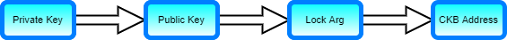

# Unused Content

### Account Components

It's important to understand the relationship of the components that make up an account. We will start with: Private Key, Public Key, Lock Arg, and Address.

#### Private Key

A private key is a randomly generated value that is used to secure your accounts. The [Secp256k1](https://en.wikipedia.org/wiki/Elliptic_Curve_Digital_Signature_Algorithm) algorithm is used to create the key pair. A private key must be kept secret at all times because this is what is used to unlock funds.

#### Public Key

A public key is derived from a private key. The public key does not need to be kept a secret, and it is used as a form of identifier.

#### Lock Arg

A lock arg is a [Blake2b](https://en.wikipedia.org/wiki/BLAKE_%28hash_function%29#BLAKE2) hash of the public key, truncated to 160 bits \(20 bytes\). This is the value that is used on-chain to secure funds.

#### CKB Address

An address is a special encoded value that specifies both an identity and how it should be accessed. It also includes a checksum value so it cannot be typed incorrectly. [CKB addresses](https://github.com/nervosnetwork/rfcs/blob/master/rfcs/0021-ckb-address-format/0021-ckb-address-format.md) have many possible uses which we will cover later. For now, think of it as an encoded form of the lock arg.

#### Component Relationship

Each one of these components is derived from the previous component in a way that is cryptographically provable. As a developer, you will be working with lock args and CKB addresses often. The important thing to remember is that both of these are identifying values that are derived from a public key, which means they can be used with a locking mechanism that can be unlocked using the private key. 



### 

### 

### Inputs and Outputs

Almost every transaction has at least one input and one output. A transaction is used to describe how state changes, and a cell is the most basic representation of a single piece of state on Nervos. An input cell is the current state, and an output cell is the resulting state after the transaction executes. Below is a basic example.

This transaction has a single input cell and a single output cell. The input cell has 100 CKBytes and is owned by Alice. The output cell has 100 CKBytes and is owned by Bob. Since an input cell describes the current state, and an output describes the resulting state, we can infer that this transaction is sending 100 CKBytes from Alice to Bob.

Now let's look at how this would appear in code.

```javascript
// Add the input cell.
const input = await getLiveCell(nodeUrl, alicesCell);
skeleton = addInput(skeleton, input);

// Add a change cell as our output.
let output = {cell_output: {capacity: ckBytesToShannons(100n), lock: addressToScript(bobsAddress), type: null}, data: "0x"};
skeleton = addOutput(skeleton, output);
```


